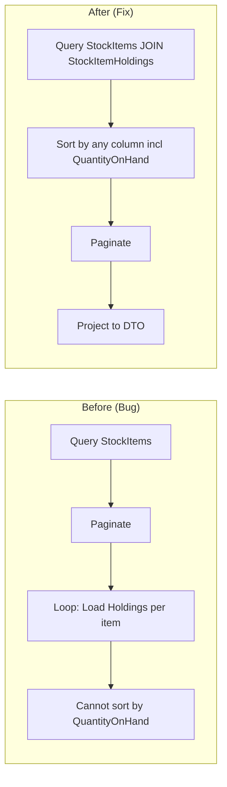

# Design Document

## Overview

This document describes the technical design for the Advanced Reports feature and the Inventory stock ordering bugfix. The Advanced Reports feature adds a new `AdvancedReportController` with 13 independent GET endpoints, each returning aggregated business intelligence data. The frontend adds a new `/advanced-report` page that calls all 13 endpoints in parallel. The inventory bugfix refactors `StockItemsController` to support sorting by `QuantityOnHand` at the database level.

## Architecture

### Advanced Report API Design

```mermaid
graph TB
    subgraph "Frontend - Advanced Report Page"
        PAGE[/advanced-report page]
        C1[Total Revenue Card]
        C2[Top Customers Card]
        C3[Top Salesman Card]
        C4[Top Products Card]
        C5[Customer Activity Card]
        C6[Sales Trend Card]
        C7[Low Stock Card]
        C8[High Stock Card]
        C9[Outstanding Balance Card]
        C10[Dormant Customers Card]
        C11[Top Stock Groups Card]
        C12[Top Suppliers Card]
        C13[Top Drivers Card]
    end

    subgraph "Backend - AdvancedReportController"
        EP1[GET /total-revenue]
        EP2[GET /top-customers]
        EP3[GET /top-salesman]
        EP4[GET /top-products]
        EP5[GET /customer-activity]
        EP6[GET /sales-trend]
        EP7[GET /low-stock]
        EP8[GET /high-stock]
        EP9[GET /top-outstanding]
        EP10[GET /dormant-customers]
        EP11[GET /top-stock-groups]
        EP12[GET /top-suppliers]
        EP13[GET /top-drivers]
    end

    PAGE --> C1 --> EP1
    PAGE --> C2 --> EP2
    PAGE --> C3 --> EP3
    PAGE --> C4 --> EP4
    PAGE --> C5 --> EP5
    PAGE --> C6 --> EP6
    PAGE --> C7 --> EP7
    PAGE --> C8 --> EP8
    PAGE --> C9 --> EP9
    PAGE --> C10 --> EP10
    PAGE --> C11 --> EP11
    PAGE --> C12 --> EP12
    PAGE --> C13 --> EP13
```


### Inventory Bugfix Architecture



## Components and Interfaces

### Backend: AdvancedReportController

**File**: `backend/WideWorldImporters.Api/Controllers/AdvancedReportController.cs`

Single controller with 13 action methods. Each method performs its own optimized query and returns a specific DTO.

```csharp
[ApiController]
[Route("api/advancedreport")]
public class AdvancedReportController : ControllerBase
{
    private readonly WideWorldImportersContext _context;

    [HttpGet("total-revenue")]
    public async Task<ActionResult<TotalRevenueDto>> GetTotalRevenue() { ... }

    [HttpGet("top-customers")]
    public async Task<ActionResult<List<TopCustomerDto>>> GetTopCustomers() { ... }

    [HttpGet("top-salesman")]
    public async Task<ActionResult<List<TopSalesmanDto>>> GetTopSalesman() { ... }

    [HttpGet("top-products")]
    public async Task<ActionResult<List<TopProductDto>>> GetTopProducts() { ... }

    [HttpGet("customer-activity")]
    public async Task<ActionResult<CustomerActivityDto>> GetCustomerActivity() { ... }

    [HttpGet("sales-trend")]
    public async Task<ActionResult<List<SalesTrendDto>>> GetSalesTrend(
        [FromQuery] string period = "month") { ... }

    [HttpGet("low-stock")]
    public async Task<ActionResult<List<StockLevelDto>>> GetLowStock() { ... }

    [HttpGet("high-stock")]
    public async Task<ActionResult<List<StockLevelDto>>> GetHighStock() { ... }

    [HttpGet("top-outstanding")]
    public async Task<ActionResult<List<TopOutstandingDto>>> GetTopOutstanding() { ... }

    [HttpGet("dormant-customers")]
    public async Task<ActionResult<List<DormantCustomerDto>>> GetDormantCustomers() { ... }

    [HttpGet("top-stock-groups")]
    public async Task<ActionResult<List<TopStockGroupDto>>> GetTopStockGroups() { ... }

    [HttpGet("top-suppliers")]
    public async Task<ActionResult<List<TopSupplierDto>>> GetTopSuppliers() { ... }

    [HttpGet("top-drivers")]
    public async Task<ActionResult<List<TopDriverDto>>> GetTopDrivers() { ... }
}
```


## Data Models

### DTO Models for Advanced Reports

**File**: `backend/WideWorldImporters.Api/Models/Dtos/AdvancedReportDtos.cs`

```csharp
namespace WideWorldImporters.Api.Models.Dtos
{
    public class TotalRevenueDto
    {
        public decimal TotalRevenue { get; set; }
        public decimal InvoiceRevenue { get; set; }
        public decimal OrderRevenue { get; set; }
    }

    public class TopCustomerDto
    {
        public int CustomerId { get; set; }
        public string CustomerName { get; set; }
        public decimal TotalRevenue { get; set; }
    }

    public class TopSalesmanDto
    {
        public int PersonId { get; set; }
        public string FullName { get; set; }
        public decimal TotalRevenue { get; set; }
    }

    public class TopProductDto
    {
        public int StockItemId { get; set; }
        public string StockItemName { get; set; }
        public decimal TotalRevenue { get; set; }
        public int TotalQuantitySold { get; set; }
    }

    public class CustomerActivityDto
    {
        public int TotalCustomers { get; set; }
        public int ActiveCustomers { get; set; }
        public int InactiveCustomers { get; set; }
        public decimal ActivePercentage { get; set; }
    }

    public class SalesTrendDto
    {
        public string PeriodLabel { get; set; }
        public decimal Revenue { get; set; }
        public int OrderCount { get; set; }
    }

    public class StockLevelDto
    {
        public int StockItemId { get; set; }
        public string StockItemName { get; set; }
        public int QuantityOnHand { get; set; }
        public int ReorderLevel { get; set; }
        public int TargetStockLevel { get; set; }
    }

    public class TopOutstandingDto
    {
        public int CustomerId { get; set; }
        public string CustomerName { get; set; }
        public decimal OutstandingBalance { get; set; }
    }

    public class DormantCustomerDto
    {
        public int CustomerId { get; set; }
        public string CustomerName { get; set; }
        public DateTime LastOrderDate { get; set; }
        public int DaysSinceLastOrder { get; set; }
    }

    public class TopStockGroupDto
    {
        public int StockGroupId { get; set; }
        public string StockGroupName { get; set; }
        public decimal TotalRevenue { get; set; }
        public int ProductCount { get; set; }
    }

    public class TopSupplierDto
    {
        public int SupplierId { get; set; }
        public string SupplierName { get; set; }
        public decimal TotalRevenue { get; set; }
        public int ProductCount { get; set; }
    }

    public class TopDriverDto
    {
        public int PersonId { get; set; }
        public string FullName { get; set; }
        public int DeliveryCount { get; set; }
        public decimal TotalRevenueDelivered { get; set; }
    }
}
```


### Frontend TypeScript Interfaces

**File**: `frontend/src/app/pages/advanced-report/models/advanced-report.models.ts`

```typescript
export interface TotalRevenue {
  totalRevenue: number;
  invoiceRevenue: number;
  orderRevenue: number;
}

export interface TopCustomer {
  customerId: number;
  customerName: string;
  totalRevenue: number;
}

export interface TopSalesman {
  personId: number;
  fullName: string;
  totalRevenue: number;
}

export interface TopProduct {
  stockItemId: number;
  stockItemName: string;
  totalRevenue: number;
  totalQuantitySold: number;
}

export interface CustomerActivity {
  totalCustomers: number;
  activeCustomers: number;
  inactiveCustomers: number;
  activePercentage: number;
}

export interface SalesTrend {
  periodLabel: string;
  revenue: number;
  orderCount: number;
}

export interface StockLevel {
  stockItemId: number;
  stockItemName: string;
  quantityOnHand: number;
  reorderLevel: number;
  targetStockLevel: number;
}

export interface TopOutstanding {
  customerId: number;
  customerName: string;
  outstandingBalance: number;
}

export interface DormantCustomer {
  customerId: number;
  customerName: string;
  lastOrderDate: string;
  daysSinceLastOrder: number;
}

export interface TopStockGroup {
  stockGroupId: number;
  stockGroupName: string;
  totalRevenue: number;
  productCount: number;
}

export interface TopSupplier {
  supplierId: number;
  supplierName: string;
  totalRevenue: number;
  productCount: number;
}

export interface TopDriver {
  personId: number;
  fullName: string;
  deliveryCount: number;
  totalRevenueDelivered: number;
}
```

## Query Design

### Endpoint Query Implementations

#### 1. Total Revenue

```sql
-- Invoice Revenue
SELECT SUM(il.ExtendedPrice) FROM Sales.InvoiceLines il

-- Order Revenue
SELECT SUM(ol.Quantity * ol.UnitPrice) FROM Sales.OrderLines ol
```

EF Core:
```csharp
var invoiceRevenue = await _context.InvoiceLines.SumAsync(il => il.ExtendedPrice);
var orderRevenue = await _context.OrderLines.SumAsync(ol => ol.Quantity * ol.UnitPrice);
```

#### 2. Top 10 Customers

```csharp
var topCustomers = await _context.InvoiceLines
    .Join(_context.Invoices, il => il.InvoiceID, i => i.InvoiceID, (il, i) => new { il.ExtendedPrice, i.CustomerID })
    .Join(_context.Customers, x => x.CustomerID, c => c.CustomerID, (x, c) => new { x.ExtendedPrice, c.CustomerID, c.CustomerName })
    .GroupBy(x => new { x.CustomerID, x.CustomerName })
    .Select(g => new TopCustomerDto
    {
        CustomerId = g.Key.CustomerID,
        CustomerName = g.Key.CustomerName,
        TotalRevenue = g.Sum(x => x.ExtendedPrice)
    })
    .OrderByDescending(x => x.TotalRevenue)
    .Take(10)
    .ToListAsync();
```

#### 3. Top 10 Salesman

```csharp
var topSalesman = await _context.InvoiceLines
    .Join(_context.Invoices, il => il.InvoiceID, i => i.InvoiceID, (il, i) => new { il.ExtendedPrice, i.SalespersonPersonID })
    .Join(_context.People, x => x.SalespersonPersonID, p => p.PersonID, (x, p) => new { x.ExtendedPrice, p.PersonID, p.FullName })
    .GroupBy(x => new { x.PersonID, x.FullName })
    .Select(g => new TopSalesmanDto
    {
        PersonId = g.Key.PersonID,
        FullName = g.Key.FullName,
        TotalRevenue = g.Sum(x => x.ExtendedPrice)
    })
    .OrderByDescending(x => x.TotalRevenue)
    .Take(10)
    .ToListAsync();
```

#### 4. Top 10 Products

```csharp
var topProducts = await _context.InvoiceLines
    .Join(_context.StockItems, il => il.StockItemID, si => si.StockItemID, (il, si) => new { il.ExtendedPrice, il.Quantity, si.StockItemID, si.StockItemName })
    .GroupBy(x => new { x.StockItemID, x.StockItemName })
    .Select(g => new TopProductDto
    {
        StockItemId = g.Key.StockItemID,
        StockItemName = g.Key.StockItemName,
        TotalRevenue = g.Sum(x => x.ExtendedPrice),
        TotalQuantitySold = g.Sum(x => x.Quantity)
    })
    .OrderByDescending(x => x.TotalRevenue)
    .Take(10)
    .ToListAsync();
```


#### 5. Customer Activity

```csharp
var totalCustomers = await _context.Customers.CountAsync();
var ninetyDaysAgo = DateTime.UtcNow.AddDays(-90);
var activeCustomers = await _context.Orders
    .Where(o => o.OrderDate >= ninetyDaysAgo)
    .Select(o => o.CustomerID)
    .Distinct()
    .CountAsync();
var inactiveCustomers = totalCustomers - activeCustomers;
var activePercentage = totalCustomers > 0
    ? Math.Round((decimal)activeCustomers / totalCustomers * 100, 2)
    : 0m;
```

#### 6. Sales Trend

```csharp
// Example for period=month, last 12 months
var startDate = DateTime.UtcNow.AddMonths(-12);

var invoiceData = await _context.InvoiceLines
    .Join(_context.Invoices, il => il.InvoiceID, i => i.InvoiceID, (il, i) => new { il.ExtendedPrice, i.InvoiceDate })
    .Where(x => x.InvoiceDate >= startDate)
    .GroupBy(x => new { x.InvoiceDate.Year, x.InvoiceDate.Month })
    .Select(g => new
    {
        Year = g.Key.Year,
        Month = g.Key.Month,
        Revenue = g.Sum(x => x.ExtendedPrice)
    })
    .ToListAsync();

var orderData = await _context.Orders
    .Where(o => o.OrderDate >= startDate)
    .GroupBy(o => new { o.OrderDate.Year, o.OrderDate.Month })
    .Select(g => new
    {
        Year = g.Key.Year,
        Month = g.Key.Month,
        OrderCount = g.Count()
    })
    .ToListAsync();

// Merge and format as "YYYY-MM"
```

#### 7. Low Stock

```csharp
var lowStock = await _context.StockItemHoldings
    .Join(_context.StockItems, h => h.StockItemID, si => si.StockItemID,
        (h, si) => new { h, si })
    .OrderBy(x => x.h.QuantityOnHand)
    .Take(10)
    .Select(x => new StockLevelDto
    {
        StockItemId = x.si.StockItemID,
        StockItemName = x.si.StockItemName,
        QuantityOnHand = x.h.QuantityOnHand,
        ReorderLevel = x.h.ReorderLevel,
        TargetStockLevel = x.h.TargetStockLevel
    })
    .ToListAsync();
```

#### 8. High Stock

```csharp
var highStock = await _context.StockItemHoldings
    .Join(_context.StockItems, h => h.StockItemID, si => si.StockItemID,
        (h, si) => new { h, si })
    .OrderByDescending(x => x.h.QuantityOnHand)
    .Take(10)
    .Select(x => new StockLevelDto { /* same as low stock */ })
    .ToListAsync();
```

#### 9. Top Outstanding

```csharp
var topOutstanding = await _context.CustomerTransactions
    .GroupBy(ct => ct.CustomerID)
    .Select(g => new { CustomerID = g.Key, Balance = g.Sum(ct => ct.OutstandingBalance) })
    .Where(x => x.Balance > 0)
    .OrderByDescending(x => x.Balance)
    .Take(10)
    .Join(_context.Customers, x => x.CustomerID, c => c.CustomerID,
        (x, c) => new TopOutstandingDto
        {
            CustomerId = c.CustomerID,
            CustomerName = c.CustomerName,
            OutstandingBalance = x.Balance
        })
    .ToListAsync();
```

#### 10. Dormant Customers

```csharp
var today = DateTime.UtcNow;
var dormant = await _context.Orders
    .GroupBy(o => o.CustomerID)
    .Select(g => new { CustomerID = g.Key, LastOrderDate = g.Max(o => o.OrderDate) })
    .OrderBy(x => x.LastOrderDate)
    .Take(10)
    .Join(_context.Customers, x => x.CustomerID, c => c.CustomerID,
        (x, c) => new DormantCustomerDto
        {
            CustomerId = c.CustomerID,
            CustomerName = c.CustomerName,
            LastOrderDate = x.LastOrderDate,
            DaysSinceLastOrder = (int)(today - x.LastOrderDate).TotalDays
        })
    .ToListAsync();
```

#### 11. Top Stock Groups

```csharp
var topGroups = await _context.InvoiceLines
    .Join(_context.StockItemStockGroups, il => il.StockItemID, sg => sg.StockItemID,
        (il, sg) => new { il.ExtendedPrice, sg.StockGroupID, il.StockItemID })
    .GroupBy(x => x.StockGroupID)
    .Select(g => new
    {
        StockGroupID = g.Key,
        TotalRevenue = g.Sum(x => x.ExtendedPrice),
        ProductCount = g.Select(x => x.StockItemID).Distinct().Count()
    })
    .OrderByDescending(x => x.TotalRevenue)
    .Take(5)
    .Join(_context.StockGroups, x => x.StockGroupID, sg => sg.StockGroupID,
        (x, sg) => new TopStockGroupDto
        {
            StockGroupId = sg.StockGroupID,
            StockGroupName = sg.StockGroupName,
            TotalRevenue = x.TotalRevenue,
            ProductCount = x.ProductCount
        })
    .ToListAsync();
```

#### 12. Top Suppliers

```csharp
var topSuppliers = await _context.InvoiceLines
    .Join(_context.StockItems, il => il.StockItemID, si => si.StockItemID,
        (il, si) => new { il.ExtendedPrice, si.SupplierID, si.StockItemID })
    .GroupBy(x => x.SupplierID)
    .Select(g => new
    {
        SupplierID = g.Key,
        TotalRevenue = g.Sum(x => x.ExtendedPrice),
        ProductCount = g.Select(x => x.StockItemID).Distinct().Count()
    })
    .OrderByDescending(x => x.TotalRevenue)
    .Take(5)
    .Join(_context.Suppliers, x => x.SupplierID, s => s.SupplierID,
        (x, s) => new TopSupplierDto
        {
            SupplierId = s.SupplierID,
            SupplierName = s.SupplierName,
            TotalRevenue = x.TotalRevenue,
            ProductCount = x.ProductCount
        })
    .ToListAsync();
```

#### 13. Top Drivers

```csharp
var topDrivers = await _context.Invoices
    .Join(_context.People.Where(p => p.IsEmployee), i => i.SalespersonPersonID, p => p.PersonID,
        (i, p) => new { i.InvoiceID, p.PersonID, p.FullName })
    .GroupBy(x => new { x.PersonID, x.FullName })
    .Select(g => new
    {
        PersonID = g.Key.PersonID,
        FullName = g.Key.FullName,
        DeliveryCount = g.Count()
    })
    .OrderByDescending(x => x.DeliveryCount)
    .Take(5)
    .ToListAsync();

// Then load total revenue per driver
foreach (var driver in topDrivers)
{
    driver.TotalRevenueDelivered = await _context.InvoiceLines
        .Join(_context.Invoices.Where(i => i.SalespersonPersonID == driver.PersonID),
            il => il.InvoiceID, i => i.InvoiceID, (il, i) => il.ExtendedPrice)
        .SumAsync(x => x);
}
```


## Inventory Ordering Bugfix Design

### Root Cause

In `StockItemsController.cs`, the `ApplySort` method only supports sorting by columns directly on the `StockItem` entity: `stockitemid`, `stockitemname`, `unitprice`, `recommendedretailprice`. The `QuantityOnHand` field lives in the related `StockItemHoldings` table, and is currently loaded **after** pagination in a per-item loop. This means sorting by `QuantityOnHand` at the database level is impossible with the current architecture.

### Fix Strategy

Refactor the `GetStockItems` method to:

1. **Join `StockItemHoldings` early** in the query (before sorting/pagination)
2. **Add `quantityonhand` case** to `ApplySort` that sorts by the joined holdings
3. **Project to DTO in the query** instead of loading full entities and then separately loading holdings in a loop
4. **Maintain backward compatibility** — all existing sort options continue to work

### Refactored Query Architecture

```csharp
[HttpGet]
public async Task<ActionResult<PaginatedResponse<StockItemListDto>>> GetStockItems(...)
{
    var query = _context.StockItems
        .Join(_context.StockItemHoldings,
            si => si.StockItemID, h => h.StockItemID,
            (si, h) => new { StockItem = si, Holding = h })
        .Join(_context.Suppliers,
            x => x.StockItem.SupplierID, sup => sup.SupplierID,
            (x, sup) => new { x.StockItem, x.Holding, Supplier = sup });

    // Apply filters (supplier, search)
    if (!string.IsNullOrWhiteSpace(supplierId)) { ... }
    if (!string.IsNullOrWhiteSpace(search)) { ... }

    var totalCount = await query.CountAsync();

    // Apply sort — now supports quantityonhand
    var sorted = ApplySort(query, sortBy, sortDirection);

    // Paginate
    var paged = await sorted.Skip((page - 1) * pageSize).Take(pageSize).ToListAsync();

    // Project to DTO (no separate loop needed)
    var data = paged.Select(x => new StockItemListDto
    {
        StockItemId = x.StockItem.StockItemID,
        StockItemName = x.StockItem.StockItemName,
        SupplierName = x.Supplier.SupplierName,
        UnitPrice = x.StockItem.UnitPrice,
        RecommendedRetailPrice = x.StockItem.RecommendedRetailPrice,
        QuantityOnHand = x.Holding.QuantityOnHand
    }).ToList();

    return Ok(new PaginatedResponse<StockItemListDto> { ... });
}
```

### Updated ApplySort

```csharp
private static IQueryable<T> ApplySort<T>(IQueryable<T> query, string sortBy, string sortDirection)
    where T allows access to StockItem and Holding properties
{
    // Uses expression-based sorting on the joined anonymous type
    return sortBy?.ToLowerInvariant() switch
    {
        "stockitemid" => ...,
        "stockitemname" => ...,
        "unitprice" => ...,
        "recommendedretailprice" => ...,
        "quantityonhand" => desc
            ? query.OrderByDescending(x => x.Holding.QuantityOnHand)
            : query.OrderBy(x => x.Holding.QuantityOnHand),
        "suppliername" => desc
            ? query.OrderByDescending(x => x.Supplier.SupplierName)
            : query.OrderBy(x => x.Supplier.SupplierName),
        _ => query.OrderBy(x => x.StockItem.StockItemName)
    };
}
```

## Frontend Design

### Advanced Report Page Structure

**File**: `frontend/src/app/pages/advanced-report/`

```
advanced-report/
├── advanced-report.module.ts
├── advanced-report-routing.module.ts
├── advanced-report.component.ts
├── advanced-report.component.html
├── advanced-report.component.scss
├── advanced-report.service.ts
├── models/
│   └── advanced-report.models.ts
└── components/
    ├── report-card/
    │   ├── report-card.component.ts
    │   ├── report-card.component.html
    │   └── report-card.component.scss
    ├── revenue-chart/
    │   └── revenue-chart.component.ts
    ├── ranking-table/
    │   └── ranking-table.component.ts
    └── trend-chart/
        └── trend-chart.component.ts
```

### Shared Report Card Component

A reusable `ReportCardComponent` wraps each card with consistent styling:

```typescript
@Component({ selector: 'app-report-card' })
export class ReportCardComponent {
  @Input() title: string;
  @Input() loading: boolean = true;
  @Input() error: string | null = null;
  @Input() responseTime: number | null = null;
}
```

Template structure:
- Card header with title + ResponseTimeBadge
- Loading spinner (shown when `loading = true`)
- Error message (shown when `error != null`)
- Content slot via `<ng-content>` (shown when loaded successfully)

### Parallel Loading Pattern

```typescript
@Component({ ... })
export class AdvancedReportComponent implements OnInit {
  // Each card has independent state
  totalRevenue: { data: TotalRevenue | null; loading: boolean; error: string | null; time: number | null };
  topCustomers: { data: TopCustomer[] | null; loading: boolean; error: string | null; time: number | null };
  // ... 11 more

  ngOnInit(): void {
    this.loadAllReports();
  }

  private loadAllReports(): void {
    // All calls fire simultaneously
    this.loadReport('totalRevenue', () => this.reportService.getTotalRevenue());
    this.loadReport('topCustomers', () => this.reportService.getTopCustomers());
    this.loadReport('topSalesman', () => this.reportService.getTopSalesman());
    // ... 10 more
  }

  private loadReport<T>(key: string, fetchFn: () => Observable<T>): void {
    const start = performance.now();
    this[key] = { data: null, loading: true, error: null, time: null };
    fetchFn().subscribe({
      next: (data) => {
        this[key] = { data, loading: false, error: null, time: Math.round(performance.now() - start) };
      },
      error: (err) => {
        this[key] = { data: null, loading: false, error: 'Failed to load', time: null };
      }
    });
  }
}
```

### Advanced Report Service

```typescript
@Injectable({ providedIn: 'root' })
export class AdvancedReportService {
  private baseUrl = `${environment.apiUrl}/api/advancedreport`;

  constructor(private http: HttpClient) {}

  getTotalRevenue(): Observable<TotalRevenue> {
    return this.http.get<TotalRevenue>(`${this.baseUrl}/total-revenue`);
  }
  getTopCustomers(): Observable<TopCustomer[]> {
    return this.http.get<TopCustomer[]>(`${this.baseUrl}/top-customers`);
  }
  // ... 11 more methods
  getSalesTrend(period: string = 'month'): Observable<SalesTrend[]> {
    return this.http.get<SalesTrend[]>(`${this.baseUrl}/sales-trend`, { params: { period } });
  }
}
```


## Correctness Properties

### Property 1: Endpoint Independence

*For any* single Advanced Report endpoint failure (HTTP 5xx), all other 12 endpoints SHALL continue to return HTTP 200 with correct data. No endpoint depends on or waits for any other endpoint.

**Validates: Requirements 1.2, 1.4, 15.5**

### Property 2: Total Revenue Consistency

*For any* call to `GET /api/advancedreport/total-revenue`, the response SHALL satisfy `totalRevenue == invoiceRevenue + orderRevenue` (mathematical equality within decimal precision).

**Validates: Requirement 2.4**

### Property 3: Top-N Ordering Guarantee

*For any* top-N endpoint (top-customers, top-salesman, top-products, top-outstanding, top-stock-groups, top-suppliers, top-drivers), the returned array SHALL be ordered by the ranking metric in descending order, and for dormant-customers SHALL be ordered by `lastOrderDate` ascending. Each item[i].metric >= item[i+1].metric (or <= for ascending).

**Validates: Requirements 3.1, 4.1, 5.1, 10.1, 11.1, 12.1, 13.1, 14.1**

### Property 4: Result Set Size Bounds

*For any* top-10 endpoint, the response array length SHALL be <= 10. *For any* top-5 endpoint, the response array length SHALL be <= 5. No endpoint SHALL return more items than its specified limit.

**Validates: Requirements 3.4, 4.4, 5.5, 8.4, 9.3, 10.5, 11.6, 12.5, 13.5, 14.6**

### Property 5: Customer Activity Arithmetic

*For any* call to `GET /api/advancedreport/customer-activity`, the response SHALL satisfy: `totalCustomers == activeCustomers + inactiveCustomers` AND `activePercentage == round((activeCustomers / totalCustomers) * 100, 2)`.

**Validates: Requirements 6.3, 6.4, 6.5**

### Property 6: Sales Trend Period Filtering

*For any* valid `period` value (`week`, `month`, `year`), the `GET /api/advancedreport/sales-trend` endpoint SHALL return data grouped by the corresponding time granularity and ordered chronologically.

**Validates: Requirements 7.2, 7.3, 7.4, 7.5**

### Property 7: Inventory Sort Correctness

*For any* call to `GET /api/stockitems?sortBy=quantityonhand&sortDirection=asc`, the returned items SHALL have `quantityOnHand` values in non-decreasing order. For `sortDirection=desc`, values SHALL be in non-increasing order. This ordering SHALL be consistent across paginated pages.

**Validates: Requirements 16.1, 16.2, 16.3**

### Property 8: Backward Compatibility

*For any* existing sort column (`stockitemid`, `stockitemname`, `unitprice`, `recommendedretailprice`) in the StockItems endpoint, the behavior SHALL be identical to before the fix. All existing integration tests SHALL pass without modification.

**Validates: Requirements 16.4, 17.5, 17.6**

## Error Handling

### Backend Error Handling

Each Advanced Report endpoint wraps its query in try-catch:

```csharp
[HttpGet("total-revenue")]
public async Task<ActionResult<TotalRevenueDto>> GetTotalRevenue()
{
    try
    {
        // ... query logic
        return Ok(result);
    }
    catch (Exception ex)
    {
        // Logged by existing middleware, returns 500
        throw;
    }
}
```

The existing `ExceptionHandlingMiddleware` handles:
- `SqlException` (connection) → HTTP 503
- Unhandled exceptions → HTTP 500

Each endpoint is independent — a failure in one does not cascade to others.

### Frontend Error Handling

Each report card handles its own error state:
- Shows loading spinner while waiting
- Shows error message if the API call fails
- Other cards continue loading/displaying normally
- No retry logic (consistent with existing app pattern)

## Testing Strategy

### Backend Integration Tests

**File**: `backend/WideWorldImporters.IntegrationTests/Controllers/AdvancedReportControllerTests.cs`

Tests per endpoint (13 × ~3 assertions = 39+ test assertions):
- HTTP 200 status code
- Response body matches expected DTO shape (correct fields, correct types)
- Data correctness checks (e.g., totalRevenue == invoiceRevenue + orderRevenue)
- Top-N ordering verification (each item's metric >= next item's metric)
- Result count <= expected limit (10 or 5)

Sales Trend specific tests:
- `period=month` returns entries with "YYYY-MM" format labels
- `period=week` returns entries with "YYYY-Www" format labels
- `period=year` returns entries with "YYYY" format labels
- Invalid period value returns reasonable default (month)

**File**: `backend/WideWorldImporters.IntegrationTests/Controllers/StockItemsControllerTests.cs` (add tests)

New tests for inventory sort fix:
- `sortBy=quantityonhand&sortDirection=asc` returns items in ascending quantity order
- `sortBy=quantityonhand&sortDirection=desc` returns items in descending quantity order
- Existing sort options still work (regression test)
- QuantityOnHand is populated (not 0) in list response after refactor

### Frontend E2E Tests (Playwright)

**File**: `frontend/e2e/advanced-report.spec.ts`

Tests:
- Navigation: "Advanced Report" link exists in sidebar and navigates to `/advanced-report`
- Page loads: All 13 report cards are rendered (by heading or data-testid)
- Parallel loading: Cards appear independently (first card visible before last card loads)
- Individual card data: At least one card shows numeric data after loading
- Error isolation: Intercepting one endpoint with 500 shows error on that card only, others render normally
- Response time badge: Each card shows "Loaded in Xms" badge
- Sales Trend filter: Period selector (week/month/year) triggers data reload
- Dark theme: Cards use correct background and accent colors

**File**: `frontend/e2e/inventory-sort.spec.ts` (or add to existing)

Tests:
- Click "Qty on Hand" column header → data reloads in different order
- Click again → toggles between asc/desc
- First item in desc order has highest QuantityOnHand value
