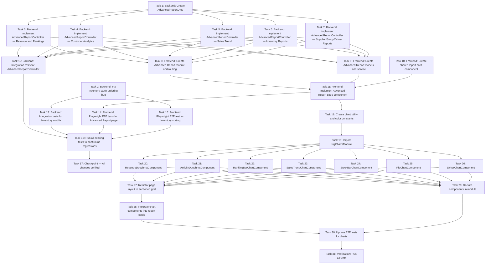

# Implementation Plan

## Overview

Implement 13 Advanced Report endpoints in a new `AdvancedReportController`, a new frontend "Advanced Report" page with parallel-loading cards, fix the Inventory stock ordering bug in `StockItemsController`, and add comprehensive test coverage for all changes. Each change must ensure all existing tests continue to pass.

## Tasks

### Wave 0: Backend DTOs and Bugfix (parallel, no frontend dependencies)

- [x] 1. Backend: Create AdvancedReportDtos
  - [x] 1.1 Create `backend/WideWorldImporters.Api/Models/Dtos/AdvancedReportDtos.cs`
    - Add all 13 DTO classes: `TotalRevenueDto`, `TopCustomerDto`, `TopSalesmanDto`, `TopProductDto`, `CustomerActivityDto`, `SalesTrendDto`, `StockLevelDto`, `TopOutstandingDto`, `DormantCustomerDto`, `TopStockGroupDto`, `TopSupplierDto`, `TopDriverDto`
    - Each DTO has properties exactly as defined in the design document
    - _Requirements: 2, 3, 4, 5, 6, 7, 8, 9, 10, 11, 12, 13, 14_

- [x] 2. Backend: Fix Inventory stock ordering bug
  - [x] 2.1 Refactor `StockItemsController.GetStockItems` to join `StockItemHoldings` and `Suppliers` early in the query
    - Replace the current pattern (load StockItems → paginate → loop to load holdings/suppliers separately) with a single joined query
    - Join: `StockItems` JOIN `StockItemHoldings` ON StockItemID JOIN `Suppliers` ON SupplierID
    - Project directly to `StockItemListDto` from the joined result (no separate per-item queries)
    - Ensure `QuantityOnHand` is populated from the join (not hardcoded to 0)
    - Ensure `SupplierName` is populated from the join (not loaded separately)
    - _Requirements: 16.6_
    - _Preservation: All existing functionality (pagination, filters, search, export) must work identically_
  - [x] 2.2 Update `ApplySort` in `StockItemsController` to support `quantityonhand` and `suppliername` sort columns
    - Add case `"quantityonhand"` → sort by `Holding.QuantityOnHand`
    - Add case `"suppliername"` → sort by `Supplier.SupplierName`
    - Keep all existing sort cases (`stockitemid`, `stockitemname`, `unitprice`, `recommendedretailprice`)
    - The method signature will need to change since sorting now operates on the joined type, not just `IQueryable<StockItem>`
    - _Requirements: 16.3, 16.4_
  - [x] 2.3 Verify existing StockItems functionality works after refactor
    - Ensure `/api/stockitems?page=1&pageSize=20` returns same data structure as before
    - Ensure `/api/stockitems?supplierId=2` filter works
    - Ensure `/api/stockitems?search=USB` works
    - Ensure `/api/stockitems?export=true` works
    - Ensure `/api/stockitems?sortBy=stockitemname&sortDirection=desc` works
    - Ensure `/api/stockitems/{id}` detail endpoint is unaffected
    - Ensure `/api/stockitems/lookup` endpoint is unaffected
    - _Requirements: 16.4, 17.5_


### Wave 1: Backend AdvancedReportController (depends on Wave 0 Task 1)

- [x] 3. Backend: Implement AdvancedReportController — Revenue and Rankings
  - [x] 3.1 Create `backend/WideWorldImporters.Api/Controllers/AdvancedReportController.cs` with constructor injection of `WideWorldImportersContext`
    - Route prefix: `[Route("api/advancedreport")]`
    - _Requirements: 1.1_
  - [x] 3.2 Implement `GET /api/advancedreport/total-revenue`
    - Calculate `invoiceRevenue = SUM(InvoiceLines.ExtendedPrice)`
    - Calculate `orderRevenue = SUM(OrderLines.Quantity * OrderLines.UnitPrice)`
    - Compute `totalRevenue = invoiceRevenue + orderRevenue`
    - Add consistency validation: verify `totalRevenue == invoiceRevenue + orderRevenue` before returning; if inconsistent, return HTTP 500 with error message `"Revenue calculation inconsistency detected"`
    - If either sub-query throws (timeout, connection failure), let the exception propagate to `ExceptionHandlingMiddleware` (no partial response)
    - Return `TotalRevenueDto` with totalRevenue, invoiceRevenue, orderRevenue
    - _Requirements: 2.1, 2.2, 2.3, 2.4_
  - [x] 3.3 Implement `GET /api/advancedreport/top-customers`
    - Join InvoiceLines → Invoices → Customers
    - Group by CustomerID/CustomerName, sum ExtendedPrice
    - Order by TotalRevenue desc, take 10
    - Return `List<TopCustomerDto>`
    - _Requirements: 3.1, 3.2, 3.3, 3.4_
  - [x] 3.4 Implement `GET /api/advancedreport/top-salesman`
    - Join InvoiceLines → Invoices → People (on SalespersonPersonID)
    - Group by PersonID/FullName, sum ExtendedPrice
    - Order by TotalRevenue desc, take 10
    - Tie-breaking is intentionally arbitrary (no secondary sort) — database engine determines non-deterministic row ordering within `OrderByDescending`
    - Return `List<TopSalesmanDto>`
    - _Requirements: 4.1, 4.2, 4.3, 4.4_
  - [x] 3.5 Implement `GET /api/advancedreport/top-products`
    - Join InvoiceLines → StockItems
    - Group by StockItemID/StockItemName, sum ExtendedPrice and Quantity
    - Order by TotalRevenue desc, take 10
    - Return `List<TopProductDto>`
    - _Requirements: 5.1, 5.2, 5.3, 5.4, 5.5_

- [x] 4. Backend: Implement AdvancedReportController — Customer Analytics
  - [x] 4.1 Implement `GET /api/advancedreport/customer-activity`
    - Count total customers
    - Count distinct customers with orders in last 90 days
    - Calculate inactive = total - active
    - Calculate activePercentage = round((active/total)*100, 2)
    - Return `CustomerActivityDto`
    - _Requirements: 6.1, 6.2, 6.3, 6.4, 6.5_
  - [x] 4.2 Implement `GET /api/advancedreport/top-outstanding`
    - Group CustomerTransactions by CustomerID, sum OutstandingBalance
    - Filter where balance > 0
    - Order by balance desc, take 10
    - Join with Customers for names
    - Return `List<TopOutstandingDto>`
    - _Requirements: 10.1, 10.2, 10.3, 10.4, 10.5_
  - [x] 4.3 Implement `GET /api/advancedreport/dormant-customers`
    - Group Orders by CustomerID, get max OrderDate
    - Order by LastOrderDate asc (oldest first), take 10
    - Calculate DaysSinceLastOrder = (today - lastOrderDate).TotalDays
    - Join with Customers for names
    - Return `List<DormantCustomerDto>`
    - _Requirements: 11.1, 11.2, 11.3, 11.4, 11.5, 11.6_

- [x] 5. Backend: Implement AdvancedReportController — Sales Trend
  - [x] 5.1 Implement `GET /api/advancedreport/sales-trend?period=month|week|year`
    - Accept `[FromQuery] string period = "month"` parameter
    - For `month`: group by Year/Month for last 12 months, format as "YYYY-MM"
    - For `week`: group by ISO week for last 12 weeks, format as "YYYY-Www"
    - For `year`: group by Year for all available data, format as "YYYY"
    - Calculate revenue from InvoiceLines (joined with Invoices for date)
    - Calculate orderCount from Orders (distinct orders per period)
    - Return `List<SalesTrendDto>` ordered chronologically
    - _Requirements: 7.1, 7.2, 7.3, 7.4, 7.5, 7.6, 7.7_

- [x] 6. Backend: Implement AdvancedReportController — Inventory Reports
  - [x] 6.1 Implement `GET /api/advancedreport/low-stock`
    - Use two-phase preferential logic:
      - Phase 1: Query items where `QuantityOnHand <= ReorderLevel`, ordered by `QuantityOnHand` asc
      - If Phase 1 yields >= 10 items, return the first 10
      - Phase 2: If fewer than 10, fill remaining slots from items NOT in Phase 1, ordered by `QuantityOnHand` asc
      - Concatenate Phase 1 + Phase 2 results (items at/below reorder level always appear first)
    - Join StockItemHoldings → StockItems
    - Return `List<StockLevelDto>` (max 10 items)
    - _Requirements: 8.1, 8.2, 8.3, 8.4_
  - [x] 6.2 Implement `GET /api/advancedreport/high-stock`
    - Join StockItemHoldings → StockItems
    - Order by QuantityOnHand desc, take 10
    - Return `List<StockLevelDto>`
    - _Requirements: 9.1, 9.2, 9.3_

- [x] 7. Backend: Implement AdvancedReportController — Supplier/Group/Driver Reports
  - [x] 7.1 Implement `GET /api/advancedreport/top-stock-groups`
    - Join InvoiceLines → StockItemStockGroups → StockGroups
    - Group by StockGroupID, sum ExtendedPrice, count distinct StockItemIDs
    - Order by TotalRevenue desc, take 5
    - Return `List<TopStockGroupDto>`
    - _Requirements: 12.1, 12.2, 12.3, 12.4, 12.5_
  - [x] 7.2 Implement `GET /api/advancedreport/top-suppliers`
    - Join InvoiceLines → StockItems (for SupplierID) → Suppliers
    - Group by SupplierID, sum ExtendedPrice, count distinct StockItemIDs
    - Filter: `.Where(x => x.TotalRevenue > 0)` — exclude suppliers with zero revenue
    - Order by TotalRevenue desc, then `.ThenBy(x => x.SupplierID)` for deterministic tie-breaking
    - Take 5
    - Return `List<TopSupplierDto>`
    - _Requirements: 13.1, 13.2, 13.3, 13.4, 13.5_
  - [x] 7.3 Implement `GET /api/advancedreport/top-drivers`
    - Join Invoices → People (where IsEmployee = true)
    - Group by PersonID/FullName, count invoices as DeliveryCount
    - Order by DeliveryCount desc, take 5
    - Calculate TotalRevenueDelivered per driver from InvoiceLines
    - Return `List<TopDriverDto>`
    - _Requirements: 14.1, 14.2, 14.3, 14.4, 14.5, 14.6_


### Wave 2: Frontend — Advanced Report Page (depends on Wave 1)

- [x] 8. Frontend: Create Advanced Report module and routing
  - [x] 8.1 Create `frontend/src/app/pages/advanced-report/advanced-report.module.ts`
    - Declare and export `AdvancedReportComponent` and child components
    - Import `CommonModule`, `SharedModule`
    - _Requirements: 15.1_
  - [x] 8.2 Create `frontend/src/app/pages/advanced-report/advanced-report-routing.module.ts`
    - Route: `{ path: '', component: AdvancedReportComponent }`
    - _Requirements: 15.1_
  - [x] 8.3 Add lazy-loaded route in app-routing module
    - `{ path: 'advanced-report', loadChildren: () => import(...).then(m => m.AdvancedReportModule) }`
    - _Requirements: 15.1_
  - [x] 8.4 Add "Advanced Report" navigation link in sidebar/nav component
    - Place between existing nav items (e.g., after Dashboard or at end)
    - Icon and styling consistent with other nav items
    - _Requirements: 15.1_

- [x] 9. Frontend: Create Advanced Report models and service
  - [x] 9.1 Create `frontend/src/app/pages/advanced-report/models/advanced-report.models.ts`
    - Define all 13 TypeScript interfaces as specified in design
    - _Requirements: 15.2_
  - [x] 9.2 Create `frontend/src/app/pages/advanced-report/advanced-report.service.ts`
    - 13 methods, one per endpoint
    - `getSalesTrend(period: string)` accepts period parameter
    - Base URL: `${environment.apiUrl}/api/advancedreport`
    - _Requirements: 15.2_

- [x] 10. Frontend: Create shared report card component
  - [x] 10.1 Create `frontend/src/app/pages/advanced-report/components/report-card/` component
    - Inputs: `title: string`, `loading: boolean`, `error: string | null`, `responseTime: number | null`
    - Shows loading spinner when `loading = true`
    - Shows error message when `error != null`
    - Shows `<ng-content>` when loaded successfully
    - Shows ResponseTimeBadge with `responseTime`
    - Dark theme styling: `#2a2a2a` card background, `#aaff00` accent
    - _Requirements: 15.3, 15.4, 15.5, 15.7_

- [x] 11. Frontend: Implement Advanced Report page component
  - [x] 11.1 Create `advanced-report.component.ts` with parallel loading logic
    - State object per card: `{ data, loading, error, time }`
    - `ngOnInit` calls all 13 service methods simultaneously
    - Each call measures its own response time via `performance.now()`
    - Each call independently sets loading/data/error state
    - _Requirements: 15.2, 15.3, 15.5_
  - [x] 11.2 Create `advanced-report.component.html` with responsive grid layout
    - Responsive grid: 3 columns on desktop (>1200px), 2 columns on tablet (>768px), 1 column on mobile
    - 13 `<app-report-card>` instances, each with appropriate content:
      - Total Revenue: large number + small breakdown (invoice/order)
      - Top 10/5 lists: ranking table with position number, name, metric
      - Customer Activity: numbers + percentage bar
      - Sales Trend: period selector dropdown + bar/line chart or simple table
      - Stock reports: table with name + quantity + levels
    - _Requirements: 15.6_
  - [x] 11.3 Create `advanced-report.component.scss` with dark theme styling
    - Card grid layout with gap spacing
    - Consistent with app's dark theme (`#121212` bg, `#2a2a2a` cards, `#aaff00` accent)
    - _Requirements: 15.7_
  - [x] 11.4 Add Sales Trend period selector (week/month/year)
    - Dropdown or button group to select period
    - On change: reload sales-trend endpoint with new period parameter
    - _Requirements: 7.1, 15.3_


### Wave 3: Backend Tests (depends on Wave 0 + Wave 1)

- [x] 12. Backend: Integration tests for AdvancedReportController
  - [x] 12.1 Create `backend/WideWorldImporters.IntegrationTests/Controllers/AdvancedReportControllerTests.cs`
    - Use same `IClassFixture<TestWebApplicationFactory>` pattern as other test files
    - _Requirements: 17.1_
  - [x] 12.2 Test `GET /api/advancedreport/total-revenue`
    - Assert HTTP 200
    - Assert response has `totalRevenue`, `invoiceRevenue`, `orderRevenue` fields
    - Assert `totalRevenue == invoiceRevenue + orderRevenue`
    - Assert all values are non-negative decimals
    - _Requirements: 17.1, Property 2_
  - [x] 12.3 Test `GET /api/advancedreport/top-customers`
    - Assert HTTP 200
    - Assert response is JSON array with length <= 10
    - Assert each item has `customerId`, `customerName`, `totalRevenue`
    - Assert ordering: item[i].totalRevenue >= item[i+1].totalRevenue
    - _Requirements: 17.1, Property 3, Property 4_
  - [x] 12.4 Test `GET /api/advancedreport/top-salesman`
    - Assert HTTP 200, array <= 10, correct fields, descending order
    - _Requirements: 17.1, Property 3, Property 4_
  - [x] 12.5 Test `GET /api/advancedreport/top-products`
    - Assert HTTP 200, array <= 10, correct fields (`stockItemId`, `stockItemName`, `totalRevenue`, `totalQuantitySold`), descending order
    - _Requirements: 17.1, Property 3, Property 4_
  - [x] 12.6 Test `GET /api/advancedreport/customer-activity`
    - Assert HTTP 200
    - Assert response has `totalCustomers`, `activeCustomers`, `inactiveCustomers`, `activePercentage`
    - Assert `totalCustomers == activeCustomers + inactiveCustomers`
    - Assert `activePercentage` is between 0 and 100
    - _Requirements: 17.1, Property 5_
  - [x] 12.7 Test `GET /api/advancedreport/sales-trend` with period=month, week, year
    - Assert HTTP 200 for each period value
    - Assert response is JSON array, each item has `periodLabel`, `revenue`, `orderCount`
    - Assert `periodLabel` format matches expected pattern per period type
    - Assert chronological ordering
    - _Requirements: 17.1, Property 6_
  - [x] 12.8 Test `GET /api/advancedreport/low-stock`
    - Assert HTTP 200, array <= 10, correct fields
    - Assert items where `quantityOnHand <= reorderLevel` appear before items where `quantityOnHand > reorderLevel` (preferential inclusion)
    - If 10+ items meet reorder threshold, assert all 10 returned items satisfy `quantityOnHand <= reorderLevel`
    - If fewer meet threshold, assert remaining slots are filled with lowest `quantityOnHand` items
    - Within each group, assert ascending order by `quantityOnHand`
    - _Requirements: 17.1, Property 9_
  - [x] 12.9 Test `GET /api/advancedreport/high-stock`
    - Assert HTTP 200, array <= 10, correct fields, descending order by quantityOnHand
    - _Requirements: 17.1_
  - [x] 12.10 Test `GET /api/advancedreport/top-outstanding`
    - Assert HTTP 200, array <= 10, correct fields, all outstandingBalance > 0, descending order
    - _Requirements: 17.1, Property 3, Property 4_
  - [x] 12.11 Test `GET /api/advancedreport/dormant-customers`
    - Assert HTTP 200, array <= 10, correct fields, ascending order by lastOrderDate
    - Assert `daysSinceLastOrder` is a positive integer
    - _Requirements: 17.1, Property 3, Property 4_
  - [x] 12.12 Test `GET /api/advancedreport/top-stock-groups`
    - Assert HTTP 200, array <= 5, correct fields, descending order
    - _Requirements: 17.1, Property 3, Property 4_
  - [x] 12.13 Test `GET /api/advancedreport/top-suppliers`
    - Assert HTTP 200, array <= 5, correct fields
    - Assert all returned suppliers have `totalRevenue > 0` (zero-revenue suppliers excluded)
    - Assert descending order by `totalRevenue`
    - Assert when ties exist on `totalRevenue`, items are ordered by `supplierId` ascending (deterministic tie-breaking)
    - _Requirements: 17.1, Property 3, Property 4, Property 10_
  - [x] 12.14 Test `GET /api/advancedreport/top-drivers`
    - Assert HTTP 200, array <= 5, correct fields (`personId`, `fullName`, `deliveryCount`, `totalRevenueDelivered`), descending order by deliveryCount
    - _Requirements: 17.1, Property 3, Property 4_

- [x] 13. Backend: Integration tests for Inventory sort fix
  - [x] 13.1 Add test to `StockItemsControllerTests.cs`: `GetStockItems_SortByQuantityOnHand_Asc_ReturnsOrderedResults`
    - Call `GET /api/stockitems?sortBy=quantityonhand&sortDirection=asc&pageSize=10`
    - Assert HTTP 200
    - Assert each item's `quantityOnHand` <= next item's `quantityOnHand`
    - _Requirements: 17.2, Property 7_
  - [x] 13.2 Add test: `GetStockItems_SortByQuantityOnHand_Desc_ReturnsOrderedResults`
    - Call `GET /api/stockitems?sortBy=quantityonhand&sortDirection=desc&pageSize=10`
    - Assert each item's `quantityOnHand` >= next item's `quantityOnHand`
    - _Requirements: 17.2, Property 7_
  - [x] 13.3 Add test: `GetStockItems_QuantityOnHand_IsPopulated`
    - Call `GET /api/stockitems?page=1&pageSize=5`
    - Assert at least one item has `quantityOnHand > 0` (proves join works)
    - _Requirements: 17.2_
  - [x] 13.4 Run existing StockItems tests to verify no regression
    - `GetStockItems_ReturnsOkWithPaginatedJson` — still passes
    - `GetStockItem_WithValidId_ReturnsOkWithCorrectFields` — still passes
    - `GetStockItem_WithNonExistentId_Returns404WithError` — still passes
    - `GetStockItem_WithMalformedId_Returns400WithError` — still passes
    - `GetStockItemsLookup_ReturnsJsonArrayWithIdAndName` — still passes
    - _Requirements: 17.5, Property 8_


### Wave 4: Frontend E2E Tests (depends on Wave 2 + Wave 3)

- [x] 14. Frontend: Playwright E2E tests for Advanced Report page
  - [x] 14.1 Create `frontend/e2e/advanced-report.spec.ts`
    - _Requirements: 17.3_
  - [x] 14.2 Test: Navigation — "Advanced Report" link in sidebar navigates to `/advanced-report`
    - Assert nav link exists with text "Advanced Report"
    - Click link, assert URL is `/advanced-report`
    - _Requirements: 17.3, 15.1_
  - [x] 14.3 Test: Page loads with 13 report cards visible
    - Navigate to `/advanced-report`
    - Assert 13 report card elements exist (by CSS class or data-testid)
    - _Requirements: 17.3, 15.2_
  - [x] 14.4 Test: Cards show data after loading (not perpetual spinner)
    - Wait for at least one card to show non-loading content (timeout 10s)
    - Assert at least one card contains numeric data
    - _Requirements: 17.3, 15.3_
  - [x] 14.5 Test: Each card shows response time badge
    - After data loads, assert response time badge elements are visible
    - Assert badge text matches "Loaded in Xms" pattern
    - _Requirements: 17.3, 15.4_
  - [x] 14.6 Test: Error isolation — one failed endpoint shows error only on that card
    - Intercept one endpoint (e.g., `/api/advancedreport/top-drivers`) with 500
    - Assert that specific card shows error message
    - Assert other cards still load data normally
    - _Requirements: 17.3, 15.5_
  - [x] 14.7 Test: Sales Trend period selector works
    - Find period selector (dropdown/buttons)
    - Change from "month" to "week"
    - Assert card reloads with different data
    - _Requirements: 17.3, 7.1_
  - [x] 14.8 Test: Dark theme applied to report cards
    - Assert card background color is `#2a2a2a` (or equivalent rgb)
    - Assert accent color `#aaff00` is used on key elements
    - _Requirements: 17.3, 15.7_

- [x] 15. Frontend: Playwright E2E test for Inventory sorting by Quantity on Hand
  - [x] 15.1 Add test to `frontend/e2e/` (new file `inventory-sort-fix.spec.ts` or add to existing)
    - Navigate to `/inventory`
    - Wait for data to load
    - Find "Qty on Hand" or "Quantity on Hand" column header
    - Click it to sort ascending
    - Assert data order changed (first row qty <= second row qty)
    - Click again for descending
    - Assert first row qty >= second row qty
    - _Requirements: 17.4_

### Wave 5: Final Verification (depends on all previous waves)

- [x] 16. Run all existing tests to confirm no regressions
  - [x] 16.1 Run `dotnet test` from `backend/` — ALL existing tests must pass
    - Including: OrdersControllerTests, CustomersControllerTests, InvoicesControllerTests, DeliveryControllerTests, StockItemsControllerTests, SuppliersControllerTests, PurchaseOrdersControllerTests, DashboardControllerTests, WarehouseControllerTests, PaymentControllerTests, ProductSearchControllerTests, HealthControllerTests, ListEnhancementsTests
    - _Requirements: 17.5_
  - [x] 16.2 Run `ng test --watch=false` from `frontend/` — ALL existing unit tests must pass
    - _Requirements: 17.6_
  - [x] 16.3 Run `npx playwright test` from `frontend/` — ALL existing E2E tests must pass
    - Including: navigation, data-loading, filters, response-time, theme, error-handling, dashboard, list-enhancements, phase2-bugfixes
    - _Requirements: 17.6_
  - [x] 16.4 Run new tests specifically
    - `dotnet test --filter "AdvancedReport"` — all 13+ new tests pass
    - `dotnet test --filter "SortByQuantityOnHand"` — sort fix tests pass
    - `npx playwright test advanced-report.spec.ts` — new E2E tests pass
    - `npx playwright test inventory-sort-fix.spec.ts` — sort fix E2E test passes
    - _Requirements: 17.1, 17.2, 17.3, 17.4_

- [x] 17. Checkpoint — All changes verified
  - Confirm all 13 Advanced Report endpoints return correct data
  - Confirm inventory sort by QuantityOnHand works correctly
  - Confirm frontend Advanced Report page loads all cards in parallel
  - Confirm no regressions in existing functionality
  - Ask the user if questions arise

## Task Dependency Graph

```json
{
  "waves": [
    {
      "name": "Wave 0: Backend DTOs and Bugfix",
      "tasks": [1, 2],
      "parallel": true
    },
    {
      "name": "Wave 1: Backend AdvancedReportController",
      "tasks": [3, 4, 5, 6, 7],
      "parallel": true,
      "dependsOn": [1]
    },
    {
      "name": "Wave 2: Frontend Advanced Report Page",
      "tasks": [8, 9, 10, 11],
      "parallel": false,
      "dependsOn": [3, 4, 5, 6, 7]
    },
    {
      "name": "Wave 3: Backend Tests",
      "tasks": [12, 13],
      "parallel": true,
      "dependsOn": [3, 4, 5, 6, 7, 2]
    },
    {
      "name": "Wave 4: Frontend E2E Tests",
      "tasks": [14, 15],
      "parallel": true,
      "dependsOn": [11, 2]
    },
    {
      "name": "Wave 5: Final Verification",
      "tasks": [16, 17],
      "parallel": false,
      "dependsOn": [12, 13, 14, 15]
    },
    {
      "name": "Wave 6: Chart Visualizations & Layout Refactor",
      "tasks": [18, 19, 20, 21, 22, 23, 24, 25, 26, 27, 28, 29, 30, 31],
      "parallel": false,
      "dependsOn": [11, 16],
      "notes": "Tasks 18-26 (chart components) can be done in parallel. Task 27 (layout refactor) and 28 (integration) depend on 18-26. Task 29 depends on 20-26. Tasks 30-31 depend on 28-29."
    }
  ]
}
```



## Notes

### Wave 6: Chart Visualizations & Layout Refactor (depends on Wave 2 completed)

- [x] 18. Frontend: Create chart utility and color constants
  - [x] 18.1 Create `frontend/src/app/pages/advanced-report/chart-config.ts`
    - Export `CHART_COLORS` array: `['#aaff00', '#00d4ff', '#ff6b6b', '#ffa726', '#ab47bc', '#26c6da', '#7e57c2', '#66bb6a', '#ef5350', '#42a5f5']`
    - Export `CHART_COLORS_TRANSPARENT` array (same colors with `'33'` suffix for 20% opacity backgrounds)
    - Export `applyChartDefaults()` function that sets `Chart.defaults.color`, `borderColor`, tooltip styles for dark theme
    - _Requirements: 18.3_

- [x] 19. Frontend: Import NgChartsModule in AdvancedReportModule
  - [x] 19.1 Add `import { NgChartsModule } from 'ng2-charts'` to `advanced-report.module.ts`
    - Add `NgChartsModule` to the `imports` array
    - Call `applyChartDefaults()` in the module or component constructor
    - _Requirements: 18.1_

- [x] 20. Frontend: Create RevenueDoughnutComponent
  - [x] 20.1 Create `frontend/src/app/pages/advanced-report/components/revenue-doughnut/revenue-doughnut.component.ts`
    - Input: `data: TotalRevenue`
    - Doughnut chart with 2 segments: invoiceRevenue (#aaff00) and orderRevenue (#00d4ff)
    - Center overlay text showing totalRevenue formatted as currency
    - Chart options: cutout 70%, no legend (use center text instead), responsive
    - Tooltip shows segment label + currency value
    - _Requirements: 18.2 (Total Revenue), 18.5_

- [x] 21. Frontend: Create ActivityDoughnutComponent
  - [x] 21.1 Create `frontend/src/app/pages/advanced-report/components/activity-doughnut/activity-doughnut.component.ts`
    - Input: `data: CustomerActivity`
    - Doughnut chart with 2 segments: activeCustomers (#aaff00) and inactiveCustomers (#3a3a3a)
    - Center overlay text showing `activePercentage%` and label "Active"
    - Below chart: small stat line with colored dots for active/inactive counts
    - Chart options: cutout 70%, responsive
    - _Requirements: 18.2 (Customer Activity), 18.8_

- [x] 22. Frontend: Create RankingBarChartComponent (Reusable)
  - [x] 22.1 Create `frontend/src/app/pages/advanced-report/components/ranking-bar-chart/ranking-bar-chart.component.ts`
    - Inputs: `labels: string[]`, `values: number[]`, `formatType: 'currency' | 'number' | 'days'`, `barColor: string`, `colorGradient: boolean`
    - Horizontal bar chart (`indexAxis: 'y'`) showing top 5 items
    - If more than 5 items provided, show remaining as compact overflow list below chart
    - For `colorGradient=true` (dormant customers): bars colored from yellow (#ffa726) to red (#ff6b6b) based on value
    - No legend (single dataset)
    - Tooltip shows formatted value based on `formatType`
    - Y-axis labels truncated to 20 chars with ellipsis if needed
    - _Requirements: 18.2 (Top Customers, Top Salesman, Top Products, Top Outstanding, Dormant Customers), 18.5, 18.7_

- [x] 23. Frontend: Create SalesTrendChartComponent
  - [x] 23.1 Create `frontend/src/app/pages/advanced-report/components/sales-trend-chart/sales-trend-chart.component.ts`
    - Input: `data: SalesTrend[]`
    - Line chart with dual y-axes:
      - Left axis (primary): Revenue line, color #aaff00, area fill with 20% opacity
      - Right axis (secondary): Order Count line, color #00d4ff, dashed
    - X-axis: periodLabel values
    - Interaction mode: index (show both values on hover)
    - Legend positioned at bottom
    - Responsive, tension 0.3 for smooth curves
    - _Requirements: 18.2 (Sales Trend), 18.5, 18.6_

- [x] 24. Frontend: Create StockBarChartComponent
  - [x] 24.1 Create `frontend/src/app/pages/advanced-report/components/stock-bar-chart/stock-bar-chart.component.ts`
    - Inputs: `data: StockLevel[]`, `mode: 'low' | 'high'`
    - Horizontal grouped bar chart (`indexAxis: 'y'`)
    - For `mode='low'`:
      - Dataset 1 (Qty on Hand): bars colored #ff6b6b if `quantityOnHand <= reorderLevel`, else #aaff00
      - Dataset 2 (Reorder Level): bars colored #3a3a3a with dashed border
    - For `mode='high'`:
      - Dataset 1 (Qty on Hand): bars colored #aaff00
      - Dataset 2 (Target Stock Level): bars colored #3a3a3a with dashed border
    - Legend at bottom showing dataset labels
    - Y-axis: stock item names (truncated to 20 chars)
    - _Requirements: 18.2 (Low Stock, High Stock), 18.5_

- [x] 25. Frontend: Create PieChartComponent (Reusable)
  - [x] 25.1 Create `frontend/src/app/pages/advanced-report/components/pie-chart/pie-chart.component.ts`
    - Inputs: `labels: string[]`, `values: number[]`, `formatType: 'currency' | 'number'`
    - Pie chart using first N colors from CHART_COLORS
    - Legend positioned below chart with padding 12
    - Tooltip shows label + formatted value
    - Responsive
    - _Requirements: 18.2 (Top Stock Groups, Top Suppliers), 18.5, 18.8_

- [x] 26. Frontend: Create DriverChartComponent
  - [x] 26.1 Create `frontend/src/app/pages/advanced-report/components/driver-chart/driver-chart.component.ts`
    - Input: `data: TopDriver[]`
    - Mixed chart: vertical bars (delivery count) + line overlay (revenue delivered)
    - Bar dataset: color #aaff00, yAxisID 'y' (left axis, label "Deliveries")
    - Line dataset: color #00d4ff, yAxisID 'y1' (right axis, label "Revenue")
    - X-axis: driver fullName (truncated)
    - Legend at bottom
    - _Requirements: 18.2 (Top Drivers), 18.5_

- [x] 27. Frontend: Refactor Advanced Report page layout to sectioned grid
  - [x] 27.1 Refactor `advanced-report.component.ts` template to use sectioned layout
    - Replace flat `card-grid` with 5 sections: "Revenue Overview", "Top Performers", "Customer Insights", "Inventory", "Categories & Logistics"
    - Each section wrapped in `<section class="report-section">` with `<h2 class="section-header">`
    - Revenue Overview: `revenue-grid` (1fr 2fr) — Total Revenue (1 col) + Sales Trend (2 col span)
    - Top Performers: `three-col` — Top Customers + Top Salesman + Top Products
    - Customer Insights: `three-col` — Customer Activity + Top Outstanding + Dormant Customers
    - Inventory: `two-col` — Low Stock + High Stock
    - Categories & Logistics: `three-col` — Top Stock Groups + Top Suppliers + Top Drivers
    - _Requirements: 19.1, 19.2, 19.3_
  - [x] 27.2 Update SCSS to implement sectioned layout
    - `.report-section` with `margin-bottom: 32px`
    - `.section-header` with color #888, font-size 12px, uppercase, letter-spacing 1px
    - `.section-grid` with `display: grid`, `gap: 16px`, `align-items: stretch`
    - `.revenue-grid`: `grid-template-columns: 1fr 2fr`
    - `.three-col`: `grid-template-columns: repeat(3, 1fr)`
    - `.two-col`: `grid-template-columns: repeat(2, 1fr)`
    - Tablet (768-1200px): revenue-grid → 1fr 1fr, three-col → repeat(2, 1fr)
    - Mobile (<768px): all grids → 1fr
    - _Requirements: 19.4, 19.5, 19.6, 19.7, 19.8_

- [x] 28. Frontend: Integrate chart components into report cards
  - [x] 28.1 Replace Total Revenue card content with `<app-revenue-doughnut>`
    - Pass `[data]="totalRevenue.data"` to the doughnut component
    - _Requirements: 18.2_
  - [x] 28.2 Replace Top Customers/Salesman/Products card content with `<app-ranking-bar-chart>`
    - Map data arrays to `labels` and `values` inputs
    - Set `formatType="currency"` for revenue-based rankings
    - _Requirements: 18.2, 18.7_
  - [x] 28.3 Replace Customer Activity card content with `<app-activity-doughnut>`
    - Pass `[data]="customerActivity.data"` to the doughnut component
    - _Requirements: 18.2_
  - [x] 28.4 Replace Sales Trend card content with `<app-sales-trend-chart>`
    - Keep period selector buttons above the chart
    - Pass `[data]="salesTrend.data"` to the chart component
    - _Requirements: 18.2, 18.6_
  - [x] 28.5 Replace Low Stock/High Stock card content with `<app-stock-bar-chart>`
    - Pass `[data]` and `[mode]="'low'"` or `[mode]="'high'"`
    - _Requirements: 18.2_
  - [x] 28.6 Replace Top Outstanding card content with `<app-ranking-bar-chart>`
    - Map to `labels` (customerName) and `values` (outstandingBalance)
    - Set `formatType="currency"`
    - _Requirements: 18.2_
  - [x] 28.7 Replace Dormant Customers card content with `<app-ranking-bar-chart>`
    - Map to `labels` (customerName) and `values` (daysSinceLastOrder)
    - Set `formatType="days"`, `colorGradient=true`
    - _Requirements: 18.2_
  - [x] 28.8 Replace Top Stock Groups/Suppliers card content with `<app-pie-chart>`
    - Map data arrays to `labels` and `values` inputs
    - Set `formatType="currency"`
    - _Requirements: 18.2, 18.8_
  - [x] 28.9 Replace Top Drivers card content with `<app-driver-chart>`
    - Pass `[data]="topDrivers.data"` to the component
    - _Requirements: 18.2_

- [x] 29. Frontend: Declare all new chart components in AdvancedReportModule
  - [x] 29.1 Add all 7 chart components to `declarations` array in `advanced-report.module.ts`
    - RevenueDoughnutComponent, ActivityDoughnutComponent, RankingBarChartComponent, SalesTrendChartComponent, StockBarChartComponent, PieChartComponent, DriverChartComponent
    - _Requirements: 18.1_

- [x] 30. Frontend: Update E2E tests for chart visualizations
  - [x] 30.1 Update `frontend/e2e/advanced-report.spec.ts` to verify chart canvas elements
    - Add test: after data loads, at least one `<canvas>` element is visible inside report cards
    - Add test: verify section headers ("Revenue Overview", "Top Performers", etc.) are visible
    - _Requirements: 17.7, 17.8_
  - [x] 30.2 Update card count test if needed (cards are still 13, but layout is sectioned)
    - Ensure existing test for "13 report cards visible" still passes with new sectioned layout
    - _Requirements: 17.3_

- [x] 31. Verification: Run all tests after chart integration
  - [x] 31.1 Run `ng test --watch=false` — all unit tests pass
    - _Requirements: 17.6_
  - [x] 31.2 Run `npx playwright test` — all E2E tests pass including new chart verification tests
    - _Requirements: 17.3, 17.6_

### Parallelism Summary

| Wave | Tasks | Can Run In Parallel |
|------|-------|-------------------|
| 0 | 1, 2 | Yes (independent) |
| 1 | 3, 4, 5, 6, 7 | Yes (all independent, each adds endpoints to same controller file but different methods) |
| 2 | 8, 9, 10, 11 | Partially (10 is independent; 8+9 can parallel; 11 depends on 8+9+10) |
| 3 | 12, 13 | Yes (independent test files) |
| 4 | 14, 15 | Yes (independent test files) |
| 5 | 16, 17 | No (sequential verification) |
| 6 | 18–31 | Partially (20-26 chart components in parallel after 18+19; 27+28 sequential after components; 30+31 after integration) |

### Key Implementation Notes

1. **Inventory Bugfix**: The refactored query uses explicit joins rather than navigation properties to enable sorting on the joined `StockItemHoldings.QuantityOnHand`. The `ApplySort` method's generic type parameter changes from `IQueryable<StockItem>` to an anonymous type or a named projection class.

2. **Advanced Report Queries**: All queries should use EF Core LINQ with server-side evaluation (no `.ToList()` before aggregation). Use `.SumAsync()`, `.CountAsync()`, `.GroupBy()` that translates to SQL GROUP BY.

3. **Frontend Parallel Loading**: Use `forkJoin` or individual subscriptions (not `forkJoin` since we want independent rendering). Individual `subscribe()` calls per endpoint allow each card to render as soon as its data arrives.

4. **Sales Trend Week Calculation**: ISO week number can be calculated using `System.Globalization.ISOWeek.GetWeekOfYear()` in .NET. For EF Core, group by `(Year, DayOfYear / 7)` as an approximation or use raw SQL.

5. **Test Pattern**: Follow the existing `IClassFixture<TestWebApplicationFactory>` pattern. Each test method is independent. Use `JsonDocument.Parse` for response validation (same as existing tests).

6. **No Service Layer**: Consistent with the existing architecture, the controller directly uses `WideWorldImportersContext` without an intermediate service layer for backend queries. The frontend uses a dedicated `AdvancedReportService` for HTTP calls.

7. **Chart Integration (Wave 6)**: Uses `chart.js` 4.x + `ng2-charts` 5.x already in `package.json`. No new dependency needed. `NgChartsModule` provides the `baseChart` directive. Each chart component is self-contained with its own `ChartData` and `ChartOptions` computed from `@Input()` data. The `RankingBarChartComponent` and `PieChartComponent` are reusable across multiple cards.

8. **Chart Responsiveness**: All chart components use `responsive: true` and `maintainAspectRatio: false` (except pie/doughnut which use default aspect ratio). Cards use `min-height` to ensure charts have sufficient render space.

9. **Layout Refactor**: The flat `card-grid` is replaced with 5 semantic `<section>` elements. Each section has its own grid layout (revenue-grid, three-col, two-col). The Sales Trend card intentionally spans 2 columns to give the line chart horizontal breathing room.
