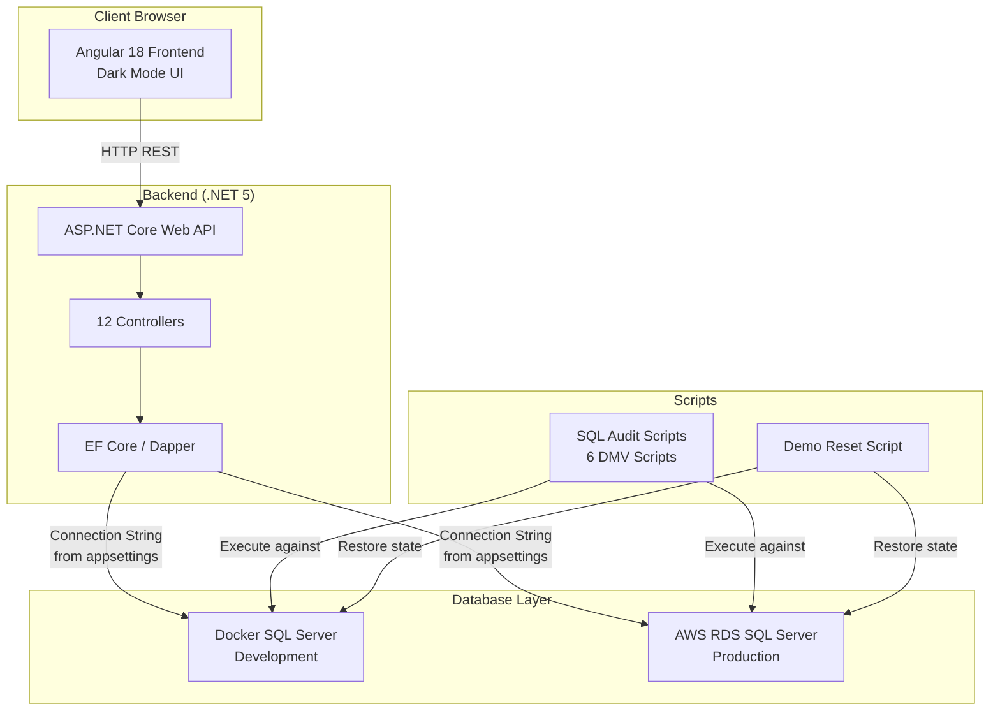

# Design Document

## Overview

This document describes the technical design for the AWS Summit Jakarta 2026 demo booth application. The application demonstrates SQL Server query optimization on .NET Core assisted by Kiro AI. It consists of three primary components:

1. **Backend** — ASP.NET Core 5 Web API with 12 controllers, some containing intentionally naive query patterns
2. **Frontend** — Angular 18 SPA with 12 pages, dark-mode UI, dropdown filters, and response-time badges
3. **Database** — SQL Server with WideWorldImporters (Full backup) running in Docker locally or AWS RDS in production

The system is designed as a monorepo with clear separation between backend, frontend, and scripts. The demo workflow involves showing slow queries in the "before" state, running DMV-based audit scripts, using Kiro to identify and fix issues, and visually confirming improvement via the frontend's response time badges.

## Architecture

### System Architecture Diagram



### Data Flow

1. User navigates Angular frontend → frontend sends HTTP request with timer started
2. ASP.NET Core controller receives request → executes EF Core / Dapper query against SQL Server
3. SQL Server returns result set → controller maps to DTO → returns JSON response
4. Frontend receives response → stops timer → renders data + response time badge
5. During demo: audit scripts are run against SQL Server → Kiro analyzes results → recommends fixes → developer applies fix → frontend shows improvement

### Environment Strategy

| Environment | Database | Connection Source | Purpose |
|---|---|---|---|
| Development | Docker container (localhost:1433) | `appsettings.Development.json` | Local dev & laptop demo |
| Production | AWS RDS SQL Server | Environment variables → `appsettings.Production.json` fallback | Booth cloud demo |

## Components and Interfaces

### Backend Components

#### Project Structure

```
backend/
├── WideWorldImporters.Api/
│   ├── Program.cs
│   ├── Startup.cs
│   ├── WideWorldImporters.Api.csproj
│   ├── appsettings.json
│   ├── appsettings.Development.json.example
│   ├── appsettings.Production.json.example
│   ├── Controllers/
│   │   ├── OrdersController.cs
│   │   ├── SalesReportController.cs
│   │   ├── ProductSearchController.cs
│   │   ├── CustomersController.cs
│   │   ├── SuppliersController.cs
│   │   ├── PurchaseOrdersController.cs
│   │   ├── StockItemsController.cs
│   │   ├── InvoicesController.cs
│   │   ├── DeliveryController.cs
│   │   ├── DashboardController.cs
│   │   ├── WarehouseController.cs
│   │   └── PaymentController.cs
│   ├── Models/
│   │   ├── Entities/          (EF Core entity classes)
│   │   └── Dtos/              (response DTOs)
│   ├── Data/
│   │   └── WideWorldImportersContext.cs
│   ├── Services/
│   │   └── (business logic services per domain)
│   └── Middleware/
│       └── ExceptionHandlingMiddleware.cs
├── WideWorldImporters.IntegrationTests/
│   ├── WideWorldImporters.IntegrationTests.csproj
│   ├── TestWebApplicationFactory.cs
│   └── Controllers/
│       └── (one test file per controller)
└── WideWorldImporters.sln
```

#### Controller-to-Schema Mapping

| Controller | Primary Tables | Joins | Naive Pattern |
|---|---|---|---|
| OrdersController | Sales.Orders | Sales.OrderLines, Warehouse.StockItems, Sales.Customers | N+1 loading order lines |
| SalesReportController | Sales.InvoiceLines | Sales.Invoices, Sales.Customers, Warehouse.StockItems | Missing composite index on date + customer filter |
| ProductSearchController | Warehouse.StockItems | Warehouse.StockItemStockGroups, Warehouse.StockGroups, Purchasing.Suppliers | Multi-column filter without composite index |
| CustomersController | Sales.Customers | Sales.Orders, Sales.Invoices, Sales.CustomerTransactions | N+1 loading summary fields (last transaction, pending payment, invoice count) |
| SuppliersController | Purchasing.Suppliers | Purchasing.SupplierCategories, Purchasing.PurchaseOrders | Normal (optimized) |
| PurchaseOrdersController | Purchasing.PurchaseOrders | Purchasing.PurchaseOrderLines, Warehouse.StockItems, Purchasing.Suppliers | Normal (optimized) |
| StockItemsController | Warehouse.StockItems | Warehouse.StockItemHoldings, Purchasing.Suppliers | SELECT * pattern (retrieves all columns, uses <50%) |
| InvoicesController | Sales.Invoices | Sales.InvoiceLines, Sales.Customers | SELECT * pattern + missing index on date range filter |
| DeliveryController | Sales.Invoices | Application.People (drivers), Sales.InvoiceLines | Normal (optimized) |
| DashboardController | Sales.Orders, Sales.InvoiceLines | Sales.Customers, Warehouse.StockItems | Suboptimal LINQ aggregation causing sort on large table |
| WarehouseController | Warehouse.StockItemTransactions | Warehouse.StockItems, Warehouse.StockItemHoldings | Normal (optimized) |
| PaymentController | Sales.CustomerTransactions | Sales.Customers | Normal (optimized) |

#### Naive Query Distribution

- **N+1 Pattern** (2 controllers): OrdersController, CustomersController
- **SELECT * Pattern** (2 controllers): StockItemsController, InvoicesController
- **Unpaginated Dropdowns** (2+ endpoints): Customers lookup, StockItems lookup (both return full tables without LIMIT)
- **Missing Index / Table Scan** (2 controllers): SalesReportController, ProductSearchController
- **Suboptimal LINQ** (1 controller): DashboardController

#### API Endpoint Design

All list endpoints follow a consistent pattern:

```
GET /api/{resource}?page=1&pageSize=20&{filters}
```

Response envelope:

```json
{
  "data": [...],
  "page": 1,
  "pageSize": 20,
  "totalCount": 1234
}
```

Detail endpoints:

```
GET /api/{resource}/{id}
```

Lookup/dropdown endpoints:

```
GET /api/{resource}/lookup
```

Response format for lookups:

```json
[
  { "id": 1, "name": "Customer Name" },
  { "id": 2, "name": "Another Customer" }
]
```

#### Health Check Endpoint

```
GET /health
```

Returns HTTP 200 with `{ "status": "healthy" }` when database is reachable, or HTTP 503 with `{ "status": "unhealthy", "error": "..." }` when unreachable.

#### Error Response Format

All error responses follow a consistent structure:

```json
{
  "error": "Resource 'Order' with identifier '99999' was not found"
}
```

```json
{
  "error": "Invalid identifier format: 'abc' is not a valid numeric identifier"
}
```

```json
{
  "errorCode": "DATABASE_UNAVAILABLE",
  "message": "Unable to connect to the database. Please try again later."
}
```

### Frontend Components

#### Project Structure

```
frontend/
├── angular.json
├── package.json
├── playwright.config.ts
├── src/
│   ├── app/
│   │   ├── app.module.ts
│   │   ├── app-routing.module.ts
│   │   ├── app.component.ts
│   │   ├── core/
│   │   │   ├── services/
│   │   │   │   └── api.service.ts          (HTTP client with timing interceptor)
│   │   │   ├── interceptors/
│   │   │   │   └── timing.interceptor.ts   (measures request duration)
│   │   │   └── models/
│   │   │       └── paginated-response.ts
│   │   ├── shared/
│   │   │   ├── components/
│   │   │   │   ├── response-time-badge/
│   │   │   │   ├── data-table/
│   │   │   │   ├── dropdown-filter/
│   │   │   │   └── error-message/
│   │   │   └── pipes/
│   │   └── pages/
│   │       ├── dashboard/
│   │       ├── orders/
│   │       ├── sales-report/
│   │       ├── product-search/
│   │       ├── customers/
│   │       ├── suppliers/
│   │       ├── purchase-orders/
│   │       ├── inventory/
│   │       ├── invoices/
│   │       ├── deliveries/
│   │       ├── warehouse/
│   │       └── payments/
│   ├── environments/
│   │   ├── environment.ts
│   │   └── environment.prod.ts
│   ├── styles.scss                    (global dark theme variables)
│   └── assets/
├── e2e/
│   ├── navigation.spec.ts
│   ├── data-loading.spec.ts
│   ├── filters.spec.ts
│   ├── response-time.spec.ts
│   ├── theme.spec.ts
│   └── error-handling.spec.ts
```

#### Shared Components

**ResponseTimeBadge**
- Input: `timeMs: number | null`, `error: boolean`
- Displays "Loaded in {time}ms" or "Request failed"
- Uses accent color `#aaff00`, minimum 16px font
- Animates on value change (300-600ms highlight)

**DataTable**
- Input: `columns: ColumnDef[]`, `data: any[]`, `loading: boolean`
- Renders paginated data table with dark theme styling
- Supports column sorting indicators

**DropdownFilter**
- Input: `options: LookupItem[]`, `placeholder: string`
- Output: `selectionChange: EventEmitter<number>`
- Styled with dark theme surface colors

#### Timing Interceptor

An Angular HTTP interceptor measures elapsed time for every API call:

```typescript
intercept(req: HttpRequest<any>, next: HttpHandler): Observable<HttpEvent<any>> {
  const startTime = performance.now();
  return next.handle(req).pipe(
    tap(event => {
      if (event instanceof HttpResponse) {
        const elapsed = Math.round(performance.now() - startTime);
        this.timingService.setLastResponseTime(elapsed);
      }
    }),
    catchError(error => {
      this.timingService.setRequestFailed();
      throw error;
    })
  );
}
```

#### Theme Configuration (SCSS Variables)

```scss
$bg-main: #121212;
$bg-sidebar: #1a1a1a;
$bg-surface: #2a2a2a;
$color-primary: #aaff00;
$color-text: #ffffff;
$color-text-secondary: #b0b0b0;
```

### Scripts Components

#### Folder Structure

```
scripts/
├── audit/
│   ├── 01-wait-stats.sql
│   ├── 02-top-io-queries.sql
│   ├── 03-current-indexes.sql
│   ├── 04-index-usage-stats.sql
│   ├── 05-missing-indexes.sql
│   └── 06-index-fragmentation.sql
└── reset/
    └── demo-reset.sql
```

#### Demo Reset Script Design

The reset script performs these steps in order:

1. Drop all non-default indexes added during optimization (identified by naming convention or by comparing against a baseline)
2. Execute `DBCC FREEPROCCACHE` to clear procedure cache
3. Execute `DBCC DROPCLEANBUFFERS` to clear buffer pool
4. Output confirmation message with status per step

The script is idempotent — uses `IF EXISTS` checks before dropping indexes and handles already-clean states gracefully.

### Docker Compose Configuration

```yaml
version: '3.8'
services:
  sqlserver:
    image: mcr.microsoft.com/mssql/server:2022-latest
    platform: linux/amd64
    environment:
      - ACCEPT_EULA=Y
      - MSSQL_SA_PASSWORD=${SA_PASSWORD:-YourStrong!Passw0rd}
      - MSSQL_PID=Developer
    ports:
      - "1433:1433"
    volumes:
      - sqlserver-data:/var/opt/mssql
      - ./scripts/init:/docker-entrypoint-initdb.d
    command: /bin/bash /docker-entrypoint-initdb.d/restore-database.sh
    healthcheck:
      test: /opt/mssql-tools18/bin/sqlcmd -C -S localhost -U sa -P "$$MSSQL_SA_PASSWORD" -Q "SELECT 1"
      interval: 10s
      timeout: 5s
      retries: 10
      start_period: 30s

volumes:
  sqlserver-data:
```

## Data Models

### Entity Models (EF Core)

The backend uses EF Core with a `WideWorldImportersContext` mapped to the existing WideWorldImporters schema. Key entities:

#### Sales Schema

```csharp
public class Order
{
    public int OrderID { get; set; }
    public int CustomerID { get; set; }
    public int SalespersonPersonID { get; set; }
    public DateTime OrderDate { get; set; }
    public DateTime ExpectedDeliveryDate { get; set; }
    public bool IsUndersupplyBackordered { get; set; }
    
    public Customer Customer { get; set; }
    public ICollection<OrderLine> OrderLines { get; set; }
}

public class OrderLine
{
    public int OrderLineID { get; set; }
    public int OrderID { get; set; }
    public int StockItemID { get; set; }
    public string Description { get; set; }
    public int Quantity { get; set; }
    public decimal UnitPrice { get; set; }
    
    public Order Order { get; set; }
    public StockItem StockItem { get; set; }
}

public class Invoice
{
    public int InvoiceID { get; set; }
    public int CustomerID { get; set; }
    public DateTime InvoiceDate { get; set; }
    public decimal TotalDryItems { get; set; }
    public decimal TotalChillerItems { get; set; }
    
    public Customer Customer { get; set; }
    public ICollection<InvoiceLine> InvoiceLines { get; set; }
}

public class InvoiceLine
{
    public int InvoiceLineID { get; set; }
    public int InvoiceID { get; set; }
    public int StockItemID { get; set; }
    public string Description { get; set; }
    public int Quantity { get; set; }
    public decimal UnitPrice { get; set; }
    public decimal ExtendedPrice { get; set; }
    
    public Invoice Invoice { get; set; }
    public StockItem StockItem { get; set; }
}

public class Customer
{
    public int CustomerID { get; set; }
    public string CustomerName { get; set; }
    public int CustomerCategoryID { get; set; }
    public int PrimaryContactPersonID { get; set; }
    public int DeliveryCityID { get; set; }
    public decimal CreditLimit { get; set; }
    
    public ICollection<Order> Orders { get; set; }
    public ICollection<Invoice> Invoices { get; set; }
    public ICollection<CustomerTransaction> Transactions { get; set; }
}

public class CustomerTransaction
{
    public int CustomerTransactionID { get; set; }
    public int CustomerID { get; set; }
    public DateTime TransactionDate { get; set; }
    public decimal AmountExcludingTax { get; set; }
    public decimal TaxAmount { get; set; }
    public decimal TransactionAmount { get; set; }
    public decimal OutstandingBalance { get; set; }
    
    public Customer Customer { get; set; }
}
```

#### Purchasing Schema

```csharp
public class Supplier
{
    public int SupplierID { get; set; }
    public string SupplierName { get; set; }
    public int SupplierCategoryID { get; set; }
    public int PrimaryContactPersonID { get; set; }
    
    public SupplierCategory SupplierCategory { get; set; }
    public ICollection<PurchaseOrder> PurchaseOrders { get; set; }
}

public class PurchaseOrder
{
    public int PurchaseOrderID { get; set; }
    public int SupplierID { get; set; }
    public DateTime OrderDate { get; set; }
    public DateTime ExpectedDeliveryDate { get; set; }
    public bool IsOrderFinalized { get; set; }
    
    public Supplier Supplier { get; set; }
    public ICollection<PurchaseOrderLine> PurchaseOrderLines { get; set; }
}

public class PurchaseOrderLine
{
    public int PurchaseOrderLineID { get; set; }
    public int PurchaseOrderID { get; set; }
    public int StockItemID { get; set; }
    public int OrderedOuters { get; set; }
    public int ReceivedOuters { get; set; }
    public decimal ExpectedUnitPricePerOuter { get; set; }
    
    public PurchaseOrder PurchaseOrder { get; set; }
    public StockItem StockItem { get; set; }
}
```

#### Warehouse Schema

```csharp
public class StockItem
{
    public int StockItemID { get; set; }
    public string StockItemName { get; set; }
    public int SupplierID { get; set; }
    public decimal UnitPrice { get; set; }
    public decimal RecommendedRetailPrice { get; set; }
    public decimal TaxRate { get; set; }
    public decimal TypicalWeightPerUnit { get; set; }
    
    public Supplier Supplier { get; set; }
    public StockItemHolding StockItemHolding { get; set; }
    public ICollection<StockItemStockGroup> StockItemStockGroups { get; set; }
}

public class StockItemHolding
{
    public int StockItemID { get; set; }
    public int QuantityOnHand { get; set; }
    public int ReorderLevel { get; set; }
    public int TargetStockLevel { get; set; }
    
    public StockItem StockItem { get; set; }
}

public class StockItemTransaction
{
    public int StockItemTransactionID { get; set; }
    public int StockItemID { get; set; }
    public DateTime TransactionOccurredWhen { get; set; }
    public decimal Quantity { get; set; }
    
    public StockItem StockItem { get; set; }
}
```

#### Application Schema

```csharp
public class Person
{
    public int PersonID { get; set; }
    public string FullName { get; set; }
    public string PreferredName { get; set; }
    public bool IsEmployee { get; set; }
}
```

### DTO Models

DTOs are separate from entities to support column projection (avoiding SELECT * in optimized controllers):

```csharp
// List DTOs (minimal fields for table display)
public class OrderListDto
{
    public int OrderId { get; set; }
    public string CustomerName { get; set; }
    public DateTime OrderDate { get; set; }
    public DateTime ExpectedDeliveryDate { get; set; }
    public int LineCount { get; set; }
    public decimal TotalAmount { get; set; }
}

// Detail DTOs (full entity with related data)
public class OrderDetailDto
{
    public int OrderId { get; set; }
    public string CustomerName { get; set; }
    public DateTime OrderDate { get; set; }
    public DateTime ExpectedDeliveryDate { get; set; }
    public List<OrderLineDto> Lines { get; set; }
}

// Lookup DTOs (for dropdown filters)
public class LookupDto
{
    public int Id { get; set; }
    public string Name { get; set; }
}

// Paginated response wrapper
public class PaginatedResponse<T>
{
    public List<T> Data { get; set; }
    public int Page { get; set; }
    public int PageSize { get; set; }
    public int TotalCount { get; set; }
}
```

### Frontend Models (TypeScript)

```typescript
export interface PaginatedResponse<T> {
  data: T[];
  page: number;
  pageSize: number;
  totalCount: number;
}

export interface LookupItem {
  id: number;
  name: string;
}

export interface OrderListItem {
  orderId: number;
  customerName: string;
  orderDate: string;
  expectedDeliveryDate: string;
  lineCount: number;
  totalAmount: number;
}

export interface OrderDetail {
  orderId: number;
  customerName: string;
  orderDate: string;
  expectedDeliveryDate: string;
  lines: OrderLineItem[];
}
```

## Correctness Properties

*A property is a characteristic or behavior that should hold true across all valid executions of a system — essentially, a formal statement about what the system should do. Properties serve as the bridge between human-readable specifications and machine-verifiable correctness guarantees.*

### Property 1: Pagination invariant

*For any* list endpoint and any valid page/pageSize parameters (where pageSize is between 1 and 100), the number of items returned in the `data` array SHALL be less than or equal to `pageSize`, the response SHALL contain `page`, `pageSize`, and `totalCount` fields matching the request, and `totalCount` SHALL be a non-negative integer.

**Validates: Requirements 3.2, 13.5**

### Property 2: Detail endpoint returns entity with related data

*For any* detail endpoint and any valid identifier that exists in the database, the response SHALL be HTTP 200 with a JSON body containing the entity's own fields plus at least one field representing directly related entities (one level of navigation).

**Validates: Requirements 3.3, 13.6**

### Property 3: Error response consistency for not-found identifiers

*For any* detail endpoint across all 12 controllers and any non-existent but valid-format numeric identifier, the response SHALL be HTTP 404 with a JSON body containing an `error` field that includes both the resource type name and the requested identifier value.

**Validates: Requirements 3.4, 13.7**

### Property 4: Error response consistency for malformed identifiers

*For any* detail endpoint across all 12 controllers and any malformed identifier (non-numeric string when numeric is expected), the response SHALL be HTTP 400 with a JSON body containing an `error` field describing the validation failure reason.

**Validates: Requirements 3.5, 13.8**

### Property 5: Lookup endpoint size and shape constraint

*For any* lookup/dropdown endpoint, the response SHALL be a JSON array containing at most 1000 items, and each item SHALL contain a numeric `id` field and a non-empty string `name` field.

**Validates: Requirements 3.6, 13.10**

### Property 6: Database unavailability produces 503 for all endpoints

*For any* API endpoint (list, detail, lookup, aggregation, or health), when the database is unreachable, the response SHALL be HTTP 503 with a JSON body containing an `errorCode` field and a human-readable `message` field.

**Validates: Requirements 2.3, 2.4, 13.9**

### Property 7: Health check reflects live database connectivity

*For any* state of the database connection (reachable or unreachable), the `/health` endpoint SHALL return HTTP 200 with `{"status": "healthy"}` when the database is reachable, or HTTP 503 with `{"status": "unhealthy", "error": "..."}` when it is not — accurately reflecting the current connectivity state at the time of the request.

**Validates: Requirements 2.4**

### Property 8: Response time badge correctness

*For any* data-loading page in the frontend and any successful API call, the Response_Time_Badge SHALL display a positive integer value in milliseconds formatted as "Loaded in {time}ms", the badge SHALL update to reflect the latest request duration immediately upon response completion, and the badge SHALL be visible in a consistent position using the accent color `#aaff00`.

**Validates: Requirements 5.2, 12.1, 12.2, 12.3, 14.6**

### Property 9: Filter selection triggers fresh backend request

*For any* page with dropdown filters and any filter value selection, the frontend SHALL make a new HTTP request to the backend with the selected filter parameter included, and the displayed data SHALL be entirely replaced with the fresh response data — never served from local cache or previously fetched data.

**Validates: Requirements 5.4**

### Property 10: Error state preserves data and updates badge

*For any* page that has previously displayed data, when a subsequent API call fails or times out, the frontend SHALL display a user-visible error message, retain the previously displayed data on the page, and update the Response_Time_Badge to display "Request failed".

**Validates: Requirements 5.6, 12.6**

### Property 11: Demo reset script idempotence

*For any* number of consecutive executions of the Demo_Reset_Script (1, 2, or N times), the database state after execution SHALL be identical regardless of how many times the script is run, no execution SHALL produce an error, and the script SHALL complete within 30 seconds.

**Validates: Requirements 7.4**

### Property 12: Naive query performance degradation ratio

*For any* naive-pattern endpoint, after the Demo_Reset_Script has been executed and caches cleared (`DBCC FREEPROCCACHE` + `DBCC DROPCLEANBUFFERS`), the response time SHALL be at minimum 3x slower than the same endpoint's optimized equivalent when measured under identical conditions (same hardware, same dataset, cold cache).

**Validates: Requirements 11.1**

## Error Handling

### Backend Error Handling Strategy

**Global Exception Middleware**: A custom `ExceptionHandlingMiddleware` catches all unhandled exceptions and returns standardized JSON error responses:

| Exception Type | HTTP Status | Response Body |
|---|---|---|
| `EntityNotFoundException` | 404 | `{ "error": "Resource '{type}' with identifier '{id}' was not found" }` |
| `ValidationException` | 400 | `{ "error": "{validation message}" }` |
| `SqlException` (connection) | 503 | `{ "errorCode": "DATABASE_UNAVAILABLE", "message": "..." }` |
| Any unhandled exception | 500 | `{ "errorCode": "INTERNAL_ERROR", "message": "An unexpected error occurred" }` |

**Connection timeout**: 10 seconds for production, configured in connection string. If exceeded, returns 503.

**No retry logic**: Since this is a demo application, failed database connections are reported immediately without retry to keep the demo flow simple and response times predictable.

### Frontend Error Handling Strategy

**HTTP Error Interceptor**: Catches all failed HTTP responses and:
- Displays user-visible error message on the page
- Retains previously displayed data (does not clear the page)
- Sets Response_Time_Badge to "Request failed"

**Timeout**: 10-second timeout on all HTTP requests. If exceeded, treated as a failure.

**No retry**: Same rationale as backend — keeps demo behavior predictable.

### Database Reset Error Handling

The Demo_Reset_Script uses TRY/CATCH blocks around each step and outputs status messages indicating which steps succeeded or failed, and whether the final state is "fully reset" or "partially reset".

## Testing Strategy

### Integration Testing (Backend)

**Framework**: xUnit + WebApplicationFactory (in-process testing)
**Database**: Real SQL Server in Docker container (same docker-compose)
**Location**: `backend/WideWorldImporters.IntegrationTests/`

Test coverage per controller (12 controllers × 5 test categories = 60+ tests):
- List endpoint: HTTP 200, valid JSON, pagination with default page size 20 and max 100
- Detail endpoint with valid ID: HTTP 200, correct fields present
- Detail with non-existent ID: HTTP 404, JSON error field with resource type and identifier
- Detail with malformed ID: HTTP 400, JSON validation error description
- Lookup endpoint: JSON array, items have `id` (numeric) and `name` (non-empty string) fields
- Database unavailable scenario: All endpoints return HTTP 503, JSON error response with errorCode and message

**Test execution**: `dotnet test` from the `backend/` folder.

### E2E Testing (Frontend)

**Framework**: Playwright
**Location**: `frontend/e2e/`
**Configuration**: `frontend/playwright.config.ts`

Test suites:
- **Navigation** (`navigation.spec.ts`): Verify all 12 pages are reachable via nav menu links
- **Data Loading** (`data-loading.spec.ts`): Verify data appears in tables/lists within 10 seconds of navigation
- **Filters** (`filters.spec.ts`): Verify dropdown selection triggers data refresh on at least 3 pages (Orders, Sales Report, Customers)
- **Response Time Badge** (`response-time.spec.ts`): Verify badge is visible on all data pages with "Loaded in {number}ms" format, positive integer
- **Theme** (`theme.spec.ts`): Verify background color `#121212`, accent `#aaff00`, surface `#2a2a2a`
- **Error Handling** (`error-handling.spec.ts`): Verify error message displayed when backend is unavailable, previous data retained
- **Dashboard** (`dashboard.spec.ts`): Verify KPI cards with numeric values and chart DOM element presence

**Test execution**: `npx playwright test` from the `frontend/` folder.
**Time budget**: Full run completes within 5 minutes.

### Property-Based Testing

**Framework**: FsCheck (for .NET) integrated with xUnit
**Location**: `backend/WideWorldImporters.IntegrationTests/Properties/`
**Configuration**: Minimum 100 iterations per property test.

Each property test maps directly to the Correctness Properties section:

| Property | Test Description | Generator Strategy |
|---|---|---|
| Property 1 | Pagination invariant | Random page (1-50), random pageSize (1-100), random controller selection |
| Property 2 | Detail returns entity + related | Random valid IDs from each controller's domain |
| Property 3 | 404 for non-existent IDs | Random large integers (> max existing ID) across all controllers |
| Property 4 | 400 for malformed IDs | Random non-numeric strings (alpha, special chars, empty) across all controllers |
| Property 5 | Lookup max 1000, shape constraint | Iterate all lookup endpoints, verify count and item shape |
| Property 6 | 503 when DB unavailable | Random endpoint selection with DB connection severed |
| Property 7 | Health check reflects state | Toggle DB connectivity, verify health endpoint response |
| Property 11 | Reset idempotence | Run reset script N times (random N between 1-5), verify no errors |

**Tag format**: `// Feature: demo-booth-aws-summit-jkt-2026, Property {N}: {property title}`

Example:
```csharp
[Property(MaxTest = 100)]
// Feature: demo-booth-aws-summit-jkt-2026, Property 1: Pagination invariant
public Property PaginationInvariant_ReturnsCorrectPageSize(PositiveInt page, PageSize pageSize)
{
    // ...
}
```

### Unit Testing (Angular)

Unit tests for Angular components and services:
- **TimingInterceptor**: Verifies elapsed time is captured as positive integer
- **ResponseTimeBadgeComponent**: Verifies correct rendering of "Loaded in {time}ms" and "Request failed" states, animation trigger
- **DropdownFilterComponent**: Verifies selection emits event with correct value
- **ErrorMessageComponent**: Verifies error message display and previous data retention

**Framework**: Jasmine + Karma (Angular default)
**Execution**: `ng test --watch=false` from `frontend/` folder.

### Unit Testing (.NET)

Unit tests with mocked dependencies for controller logic:
- Controller action methods return correct DTOs
- Exception handling middleware maps exceptions to correct HTTP status codes
- Connection string resolution logic (env var priority over appsettings)

**Framework**: xUnit + Moq
**Location**: `backend/WideWorldImporters.UnitTests/`

### What Is NOT Property-Tested

The following are better served by integration/E2E/manual tests:
- Dark mode theme colors (visual — tested by Playwright E2E)
- Navigation routing correctness (UI — tested by Playwright E2E)
- Chart rendering on dashboard (visual — tested by Playwright E2E)
- SQL Server query execution plans (requires SSMS/profiler — manual during demo prep)
- Actual query performance ratios (hardware-dependent — verified during demo rehearsal)
- Audit script output correctness (depends on SQL Server state — integration test)
- N+1 query detection (requires SQL profiling — integration test with query counter)
- Animation timing (CSS — visual inspection + Playwright animation assertions)


## List Page Enhancements (Requirement 15)

This section describes the technical design for the 9 list page enhancements added in Requirement 15.

### 15.1 — Search

#### Backend

All list endpoints gain an optional `search` query parameter:

```
GET /api/orders?page=1&pageSize=20&search=contoso
```

Each controller applies a case-insensitive `Contains` filter against the entity's common text columns:

| Controller | Searchable Columns |
|---|---|
| Orders | CustomerName |
| Customers | CustomerName |
| Suppliers | SupplierName, SupplierCategoryName |
| PurchaseOrders | SupplierName |
| StockItems | StockItemName |
| Invoices | CustomerName |
| Deliveries | CustomerName, DriverName |
| Warehouse | StockItemName |
| Payments | CustomerName |
| ProductSearch | StockItemName, SupplierName, StockGroupName |
| SalesReport | CustomerName, StockItemName |

The search filter is applied **before** pagination and **after** other filters, so `totalCount` reflects the searched subset.

#### Frontend

A new shared `SearchInputComponent` is added to `shared/components/search-input/`:

```typescript
@Component({ selector: 'app-search-input' })
export class SearchInputComponent {
  @Output() searchChange = new EventEmitter<string>();
  // Debounces input by 400ms before emitting
}
```

Each list page includes `<app-search-input>` in the filter bar area. On emission, the page resets to `page = 1` and reloads data with the `search` param.

### 15.2 — Pagination Total Display

The `DataTable` component template's pagination section is updated to display:

```
Showing page {page} of {totalPages} ({totalCount} records)
```

This renders directly from the existing `page`, `totalPages`, and `totalCount` values already available in the component. When filters or search change, the backend returns the updated `totalCount`, so the display updates automatically.

### 15.3 — Backend Sorting

#### Backend

All list endpoints gain optional `sortBy` and `sortDirection` query parameters:

```
GET /api/orders?page=1&pageSize=20&sortBy=orderDate&sortDirection=desc
```

Implementation pattern (applied per controller):

```csharp
[HttpGet]
public async Task<ActionResult<PaginatedResponse<OrderListDto>>> GetOrders(
    int page = 1, int pageSize = 20,
    string? search = null,
    string? sortBy = null, string? sortDirection = "asc",
    /* existing filter params */)
{
    // ... build query with filters and search ...

    // Apply sorting
    query = ApplySort(query, sortBy, sortDirection);

    // Pagination
    var totalCount = await query.CountAsync();
    var data = await query.Skip((page - 1) * pageSize).Take(pageSize).ToListAsync();
}
```

Each controller defines a whitelist of valid `sortBy` values (matching the DTO field names returned to the frontend). If `sortBy` is null or not in the whitelist, the controller falls back to its existing default sort. `sortDirection` defaults to `"asc"` and accepts only `"asc"` or `"desc"`.

A private helper method per controller (or a shared extension method) maps the DTO field name to the EF Core expression:

```csharp
private IQueryable<Order> ApplySort(IQueryable<Order> query, string? sortBy, string? direction)
{
    var desc = string.Equals(direction, "desc", StringComparison.OrdinalIgnoreCase);
    return sortBy?.ToLower() switch
    {
        "orderdate" => desc ? query.OrderByDescending(o => o.OrderDate) : query.OrderBy(o => o.OrderDate),
        "customername" => desc ? query.OrderByDescending(o => o.Customer.CustomerName) : query.OrderBy(o => o.Customer.CustomerName),
        // ... other columns
        _ => query.OrderByDescending(o => o.OrderDate) // default
    };
}
```

#### Frontend

The `DataTable.sortChange` event already emits `{ column, direction }`. Each page's handler now includes these in the API request:

```typescript
onSortChange(event: SortEvent): void {
  this.sortBy = event.column;
  this.sortDirection = event.direction;
  this.page = 1;
  this.loadData();
}
```

The `loadData()` method passes `sortBy` and `sortDirection` as query params to the backend.

### 15.4 — ID Column Format Fix

The `ColumnDef` interface gains a new format option `'id'`:

```typescript
export interface ColumnDef {
  key: string;
  header: string;
  sortable?: boolean;
  width?: string;
  format?: 'currency' | 'date' | 'number' | 'id' | 'text';
}
```

In `DataTable.formatValue()`:

```typescript
case 'id':
  return String(Math.floor(Number(value)));  // plain integer, no locale formatting
```

All column definitions that currently use `format: 'number'` for ID fields (orderId, customerId, stockItemId, invoiceId, etc.) are changed to `format: 'id'`.

### 15.5 — Orders Date Range Filter

#### Backend

`OrdersController.GetOrders` gains two new optional parameters:

```csharp
public async Task<ActionResult<PaginatedResponse<OrderListDto>>> GetOrders(
    ..., DateTime? startDate = null, DateTime? endDate = null)
{
    if (startDate.HasValue)
        query = query.Where(o => o.OrderDate >= startDate.Value);
    if (endDate.HasValue)
        query = query.Where(o => o.OrderDate <= endDate.Value);
}
```

#### Frontend

The Orders page adds two date input fields (`<input type="date">`) in the filter bar for start date and end date. On change, the page resets to `page = 1` and reloads with `startDate` and `endDate` query params.

### 15.6 — Separate Detail Page

#### Routing Changes

Each list page module adds a child route for the detail view:

```typescript
// orders-routing.module.ts
const routes: Routes = [
  { path: '', component: OrdersComponent },
  { path: ':id', component: OrderDetailComponent }
];
```

New detail components are created per domain: `OrderDetailComponent`, `CustomerDetailComponent`, `SupplierDetailComponent`, `InvoiceDetailComponent`, `DeliveryDetailComponent`, `PurchaseOrderDetailComponent`, `WarehouseDetailComponent`, `PaymentDetailComponent`.

#### Navigation

- Row click in the list navigates via `this.router.navigate([row.orderId], { relativeTo: this.route })` (or equivalent per page)
- Detail page includes a "← Back to list" button that navigates back using `this.router.navigate(['..'], { relativeTo: this.route })`
- List state preservation: query params (page, filters, search, sort) are stored in the URL as query params so the browser back button naturally restores them, or `queryParamsHandling: 'preserve'` is used on back navigation

#### Detail Page Layout

Each detail page follows a consistent structure:
1. Back navigation link
2. Entity title (e.g., "Order #73506")
3. Summary fields in a card grid
4. Related data tables (e.g., order lines, recent transactions)
5. Response time badge

The existing inline detail panel code (currently appending below the list) is refactored into the new standalone detail components.

### 15.7 — Multi-Select Dropdown Filter

The existing `DropdownFilterComponent` is enhanced (or replaced with a new `MultiSelectFilterComponent`):

```typescript
@Component({ selector: 'app-dropdown-filter' })
export class DropdownFilterComponent {
  @Input() options: LookupItem[] = [];
  @Input() placeholder = 'Select...';
  @Input() label = '';
  @Input() multiple = false;  // NEW

  @Output() selectionChange = new EventEmitter<number | null>();          // single mode
  @Output() multiSelectionChange = new EventEmitter<number[]>();          // multi mode

  selectedValues: Set<number> = new Set();
}
```

**UI behavior in multi-select mode:**
- Clicking the dropdown opens a panel with checkboxes for each option
- Each checkbox toggles an item in/out of `selectedValues`
- The trigger button shows "3 selected" (or "All" / placeholder when none selected)
- A "Clear" button resets selection
- On change, emits the array of selected IDs

**Backend contract:**

Filters accept comma-separated IDs:

```
GET /api/orders?customerId=1,5,12&page=1&pageSize=20
```

Backend parses:

```csharp
if (!string.IsNullOrEmpty(customerIdParam))
{
    var ids = customerIdParam.Split(',').Select(int.Parse).ToList();
    query = query.Where(o => ids.Contains(o.CustomerID));
}
```

### 15.8 — Export to CSV

#### Frontend

A new shared `ExportCsvButtonComponent`:

```typescript
@Component({ selector: 'app-export-csv-button' })
export class ExportCsvButtonComponent {
  @Input() resourceName = '';
  @Input() columns: ColumnDef[] = [];
  @Input() fetchFn!: () => Observable<any[]>;  // function that returns all filtered data
  // On click: calls fetchFn, converts to CSV, triggers browser download
}
```

**Export flow:**
1. User clicks "Export CSV"
2. Component calls the page's fetch function which requests data from the backend with current filters applied, `pageSize` set to a large number (e.g., 10000), and **no search parameter**
3. The JSON response is converted to CSV client-side using the `columns` definitions for headers and field extraction
4. File is downloaded as `{resourceName}-export-{YYYY-MM-DD}.csv`

**CSV generation** is done in a utility function:

```typescript
export function generateCsv(data: any[], columns: ColumnDef[]): string {
  const header = columns.map(c => c.header).join(',');
  const rows = data.map(row =>
    columns.map(c => escapeCsvValue(row[c.key])).join(',')
  );
  return [header, ...rows].join('\n');
}
```

The backend does **not** need a separate CSV endpoint — the frontend reuses the existing JSON list endpoint with a large page size.

### 15.9 — Row Number Column

The `DataTable` component automatically prepends a "No." column:

- Header: "No."
- Value: `(page - 1) * pageSize + rowIndex + 1`
- Not sortable
- Fixed width (e.g., `60px`)
- Not included in `columns` input — rendered internally by the DataTable

This is handled purely in the DataTable template without requiring each page to define the column.

### Updated API Endpoint Signature (Example)

After all enhancements, a typical list endpoint looks like:

```
GET /api/orders?page=1&pageSize=20&search=contoso&sortBy=orderDate&sortDirection=desc&customerId=1,5,12&stockItemId=7&startDate=2024-01-01&endDate=2024-12-31
```

Response remains unchanged:

```json
{
  "data": [...],
  "page": 1,
  "pageSize": 20,
  "totalCount": 42
}
```

### Correctness Properties (Additions)

#### Property 13: Search reduces totalCount

*For any* list endpoint, when a `search` parameter is provided that matches fewer records than the unfiltered set, the `totalCount` in the response SHALL be less than or equal to the totalCount without the search parameter (with same filters applied).

**Validates: Requirements 15.1, 15.2**

#### Property 14: Sort order consistency

*For any* list endpoint and any valid `sortBy` + `sortDirection` combination, the returned `data` array SHALL be ordered according to the specified column and direction. Requesting the same sort twice SHALL return identical ordering.

**Validates: Requirement 15.3**

#### Property 15: Multi-select filter is superset of single-select

*For any* list endpoint with a multi-value filter (e.g., `customerId=1,5`), the result set SHALL be the union of the individual single-value filter results (i.e., equivalent to `customerId=1` UNION `customerId=5`).

**Validates: Requirement 15.7**

#### Property 16: CSV export matches filtered list (sans search)

*For any* list page, the CSV export SHALL contain exactly the records that match the current active filters with no search applied, regardless of the current pagination page.

**Validates: Requirement 15.8**
