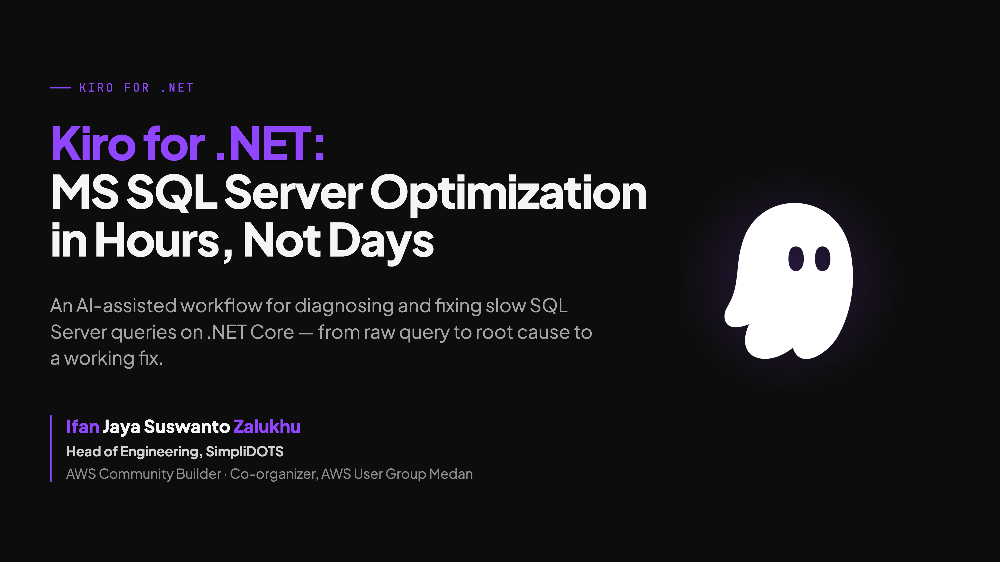
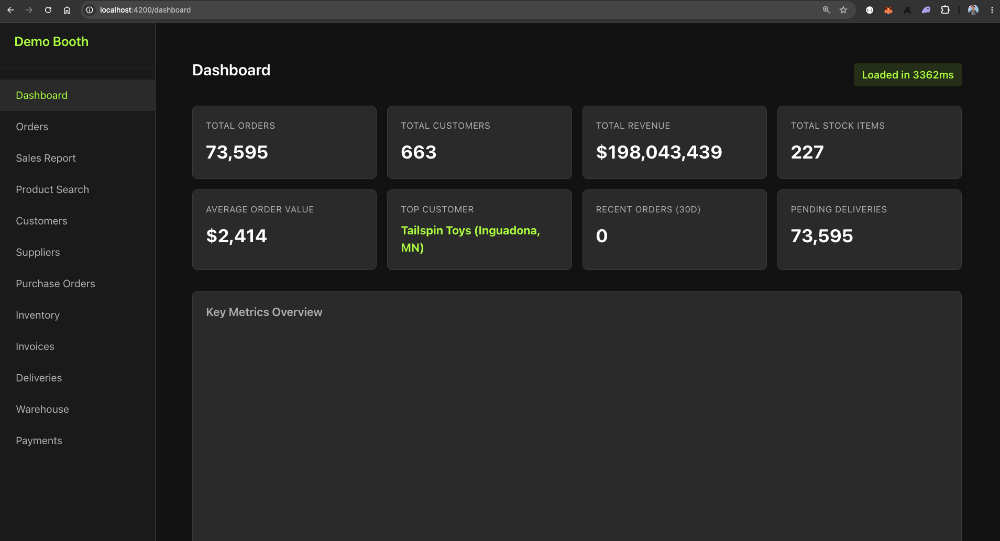
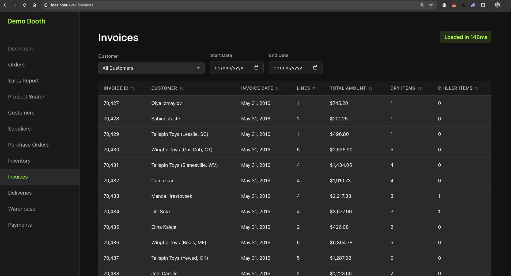

# SQL Server Query Optimization Demo

A demonstration application for AWS Summit Jakarta 2026 showcasing SQL Server query optimization on .NET Core, assisted by Kiro AI. The app features an ASP.NET Core Web API backend connected to the WideWorldImporters database and an Angular 18 frontend with a dark-mode UI that displays query performance before and after optimization.

**Pain point:** database monitoring (e.g. Performance Insights → Top SQL) shows which query is slow, but only as raw SQL and wait stats — it says nothing about which controller or LINQ query produced it, and manually tracing that through an ORM-based codebase with many modules and reports can take days, before a fix is even attempted. **Architecture:** this demo pairs the app with a custom Kiro agent, [`db-perf-analyst`](.kiro/agents/db-perf-analyst.md) (see [Kiro AI Configuration](#kiro-ai-configuration)) — feed it a slow query, database info (DMV audit results), and codebase access, and it maps the query back to its source code, audits index health, and writes prioritized recommendations (composite indexes, split queries, DTO projections) to a single analysis document. **Benefit:** what used to take days of manual tracing now takes minutes, with the engineer still validating and deciding what to apply — Kiro recommends, it doesn't decide.

This project is a companion demo for the article: [Kiro as AI Partner for MS SQL Server Optimization on .NET Core: What Used to Take Days Now Takes Hours](https://builder.aws.com/content/2yf2sol4ZERViP1ZrJtOMHQBTat/kiro-as-ai-partner-for-ms-sql-server-optimization-on-net-core-what-used-to-take-days-now-takes-hours)

## Table of Contents

- [Screenshots](#screenshots)
- [Slides](#slides)
- [Demo Videos](#demo-videos)
- [Folder Structure](#folder-structure)
- [Prerequisites](#prerequisites)
- [Development Environment Setup](#development-environment-setup)
- [Getting Started](#getting-started)
- [Running Tests](#running-tests)
- [Running Audit Scripts](#running-audit-scripts)
- [Demo Reset](#demo-reset)
- [Demo Flow](#demo-flow)
- [Kiro AI Configuration](#kiro-ai-configuration)
- [Architecture](#architecture)
- [Contact](#contact)
- [Access This Repository](#access-this-repository)

## Screenshots

### Dashboard



### Invoices



## Slides

The talk deck for this demo is at [docs/slides/index.html](docs/slides/index.html) — open it in a browser to view.

## Demo Videos

- ▶️ [Quick Highlight](https://drive.google.com/file/d/1FcFGyyXuhM1izJYmYcsE0GR6xloqkAOv/preview) (click to play)
- ▶️ [Full Demo](https://drive.google.com/file/d/1cKbbbo8VFqcmURK5oPg9DljqojBw48dy/preview) (click to play)

## Folder Structure

```
.
├── backend/                           # ASP.NET Core 5 Web API
│   ├── WideWorldImporters.Api/        # Main API project
│   │   ├── Controllers/               # 12 API controllers
│   │   ├── Data/                      # EF Core DbContext
│   │   ├── Models/                    # Entities and DTOs
│   │   ├── Middleware/                # Exception handling
│   │   └── Exceptions/               # Custom exception types
│   ├── WideWorldImporters.IntegrationTests/  # Integration + property tests
│   └── WideWorldImporters.sln
├── frontend/                          # Angular 18 SPA
│   ├── src/                           # Application source
│   │   ├── app/
│   │   │   ├── core/                  # Services, interceptors, models
│   │   │   ├── shared/                # Reusable components
│   │   │   └── pages/                 # 12 page modules
│   │   └── environments/             # Environment configs
│   ├── e2e/                           # Playwright E2E tests
│   └── playwright.config.ts
├── scripts/
│   ├── audit/                         # 4 DMV-based SQL audit scripts
│   ├── reset/                         # Demo reset script
│   └── init/                          # Docker DB initialization
└── docker-compose.yml                 # Local SQL Server container
```

## Prerequisites

| Tool | Version | Purpose |
|------|---------|---------|
| Docker Desktop | Latest | Run SQL Server locally |
| .NET SDK | 5.0 | Build and run the backend |
| Node.js | 18+ | Build and run the frontend |
| Angular CLI | 18.x | Frontend development (`npm install -g @angular/cli`) |

## Development Environment Setup

### .NET SDK Version

This project pins .NET SDK 5.0.408 via `global.json`. Any .NET 5.0.4xx SDK will work thanks to the `rollForward: latestPatch` policy.

### Apple Silicon (M1/M2/M3) Macs

.NET 5 does not have native arm64 support. If you have the x86_64 .NET SDK installed (e.g., at `~/.dotnet/x86_64`), you can use [direnv](https://direnv.net/) to automatically set the correct path when working in this project:

```bash
# Install direnv (if not already installed)
brew install direnv

# Hook direnv into your shell (add to ~/.zshrc)
eval "$(direnv hook zsh)"

# Copy the example and adjust if needed
cp .envrc.example .envrc

# Allow direnv to load the config
direnv allow .
```

This ensures `dotnet` commands in this folder use the x86_64 SDK. When you `cd` out of the project, your shell reverts to the default SDK.

> **Note**: `.envrc` is gitignored since paths vary per machine. The `.envrc.example` file is committed as a reference template.

### Windows / Linux / Intel Mac

No extra setup needed. Install [.NET 5 SDK](https://dotnet.microsoft.com/en-us/download/dotnet/5.0) and the `global.json` will ensure the correct version is used.

## Getting Started

### Clone the Repository

```bash
git clone https://github.com/ifanzalukhu97/kiro-dotnet-sql-optimization-aws-summit-jkt-2026.git
cd kiro-dotnet-sql-optimization-aws-summit-jkt-2026
```

### 1. Download Database Backup

Download the WideWorldImporters sample database backup and place it in `scripts/init/`:

**Option A: Terminal**

```bash
curl -L -o scripts/init/WideWorldImporters-Full.bak \
  https://github.com/Microsoft/sql-server-samples/releases/download/wide-world-importers-v1.0/WideWorldImporters-Full.bak
```

**Option B: Manual Download**

1. Download from: https://github.com/Microsoft/sql-server-samples/releases/download/wide-world-importers-v1.0/WideWorldImporters-Full.bak
2. Move the downloaded file to `scripts/init/WideWorldImporters-Full.bak`

> **Note**: The file is ~120 MB and is excluded from the git repository via `.gitignore`.

### 2. Database Setup

The project uses a Docker container running SQL Server 2022 with the WideWorldImporters sample database.

```bash
# Start the SQL Server container
docker-compose up -d

# Wait for the container to be healthy (~60 seconds on first run)
docker-compose ps
```

Place the `WideWorldImporters-Full.bak` backup file in the container's data directory. The init script at `scripts/init/restore-database.sh` handles the restore automatically on first startup.

The database will be accessible at `localhost:1433` with the default credentials defined in `docker-compose.yml`.

### 3. Backend Setup

```bash
cd backend

# Copy the example config and fill in your connection details
cp WideWorldImporters.Api/appsettings.Development.json.example \
   WideWorldImporters.Api/appsettings.Development.json

# Build the solution
dotnet build

# Run the API (default: http://localhost:5000)
dotnet run --project WideWorldImporters.Api
```

The backend exposes 12 API controllers at `/api/{resource}` and a health check at `/health`.

### 4. Frontend Setup

```bash
cd frontend

# Install dependencies
npm install

# Start the development server (default: http://localhost:4200)
ng serve
```

The frontend connects to the backend API URL configured in `src/environments/environment.ts`.

## Running Tests

### Backend Integration Tests

Requires a running SQL Server instance (via Docker).

```bash
cd backend
dotnet test
```

This runs all integration tests and property-based tests (FsCheck) against a real database.

### Frontend Unit Tests

```bash
cd frontend
ng test --watch=false
```

### Frontend E2E Tests (Playwright)

Requires both backend and frontend to be running.

```bash
cd frontend
npx playwright test
```

## Running Audit Scripts

The `scripts/audit/` folder contains 4 SQL scripts designed to analyze index health using SQL Server DMVs. Execute them against the WideWorldImporters database:

| Script | Purpose |
|--------|---------|
| `01-current-indexes.sql` | Existing indexes from `sys.indexes` |
| `02-index-usage-stats.sql` | Index usage from `sys.dm_db_index_usage_stats` |
| `03-missing-indexes.sql` | Missing index recommendations |
| `04-index-fragmentation.sql` | Index fragmentation analysis |

> **Note**: Slow/heavy query identification is done externally via **Performance Insights → Top SQL** (e.g., Amazon RDS Performance Insights). Copy the problematic queries from there and use Kiro AI to optimize them.

Run the audit scripts using any SQL client (SSMS, Azure Data Studio, sqlcmd):

```bash
# Example using sqlcmd
sqlcmd -S localhost -U sa -P 'YourStrong!Passw0rd' -d WideWorldImporters \
  -i scripts/audit/01-current-indexes.sql
```

## Demo Reset

Between demo sessions, reset the database to its original slow-query state:

```bash
sqlcmd -S localhost -U sa -P 'YourStrong!Passw0rd' -d WideWorldImporters \
  -i scripts/reset/demo-reset.sql
```

The reset script:
- Drops all indexes added during optimization demos
- Clears the SQL Server procedure cache (`DBCC FREEPROCCACHE`)
- Clears the buffer pool (`DBCC DROPCLEANBUFFERS`)
- Is idempotent and safe to run multiple times

## Demo Flow

1. Start with the reset database state (run the reset script)
2. Open the frontend and navigate between pages, noting response times
3. Identify slow queries from **Performance Insights → Top SQL** (copy them manually)
4. Run the audit scripts to inspect current index state and recommendations
5. Use Kiro AI to analyze and fix performance issues (add indexes, optimize queries)
6. Refresh the frontend to see improved response times via the green badges

## Kiro AI Configuration

The `.kiro/` directory contains AI-assisted development configuration:

```
.kiro/
├── steering/          # Always-on context for Kiro sessions
│   ├── tech.md         # Tech stack, build commands, SDK verification rules
│   ├── structure.md    # Project structure and architecture patterns
│   ├── product.md      # Product overview and demo flow context
│   ├── e2e-testing.md  # Playwright E2E testing conventions
│   └── ponytail.md     # Coding style (lazy senior dev — minimal, efficient)
├── agents/            # Custom agents invoked on demand
│   └── db-perf-analyst.md  # Analyzes slow queries + DMV audit results, writes optimization recommendations to db-optimization-log/
└── skills/            # On-demand skills activated by request matching
    ├── run-tests/           # Detect platform + run dotnet test correctly
    ├── code-testing-agent/  # Generate unit tests via research-plan-implement pipeline
    ├── test-gap-analysis/   # Pseudo-mutation analysis to find weak tests
    ├── dotnet-webapi/       # ASP.NET Core endpoint patterns and HTTP semantics
    └── playwright-cli/      # Playwright CLI usage for E2E test runs
```

**Steering** files load automatically every session to provide project context. **Agents** are invoked explicitly for a focused task — `db-perf-analyst` is the one driving the demo's core workflow (see [Demo Flow](#demo-flow)). **Skills** activate on-demand when your request matches their description (e.g., asking to "run tests" triggers the `run-tests` skill).

## Architecture

- **Backend**: ASP.NET Core 5 Web API with EF Core, 12 controllers (some with intentionally naive query patterns for demo purposes)
- **Frontend**: Angular 18 with dark-mode UI (`#121212` background, `#aaff00` accent), response time badges, dropdown filters
- **Database**: SQL Server 2022 with WideWorldImporters (Full backup, 200K+ rows in key tables)
- **Testing**: xUnit + FsCheck (backend), Jasmine + Karma (frontend unit), Playwright (E2E)

## Contact

- [ifanzalukhu97.com](https://www.ifanzalukhu97.com/)
- [linkedin.com/in/ifanzalukhu97](https://linkedin.com/in/ifanzalukhu97)
- [github.com/ifanzalukhu97](https://github.com/ifanzalukhu97)
- [medium.com/@ifanzalukhu97](https://medium.com/@ifanzalukhu97)
- [dev.to/ifanzalukhu97](https://dev.to/ifanzalukhu97)

## Access This Repository

Scan the QR code or use the short link below to quickly access this repository:

**Short link:** [s.id/kirofordotnet](https://s.id/kirofordotnet)


